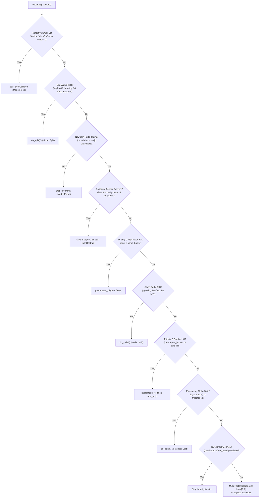

# Strategy v4.14: Adaptive ID-Differential Kamikaze, Dead-End & Enemy Trap Immunity, Risk-Calibrated Alpha Foraging, and 64-Bit Sonar Mesh

This document provides the complete mathematical, architectural, and algorithmic specification of **Bot v4.14** ([`v4.14/main.cpp`](file:///home/charitra-jain/Documents/battlecode/v4.14/main.cpp), `1593` lines).

Bot `v4.14` represents a major generational leap over [`v4.12/main.cpp`](file:///home/charitra-jain/Documents/battlecode/v4.12/main.cpp) (`1417` lines), resolving four critical strategic vulnerabilities while upgrading the inter-dragon communication protocol and combat engine:
1. **Certain-Death Trap Immunity for Neutral & Alpha Bots ([`is_dead_end_trap()`](file:///home/charitra-jain/Documents/battlecode/v4.14/main.cpp#L597-L644) & [`is_enemy_certain_death()`](file:///home/charitra-jain/Documents/battlecode/v4.14/main.cpp#L646-L676))**: Neutral harvesters still take aggressive risks (ignoring soft enemy proximity weights `pearl_risk = 0`), but are strictly forbidden from pursuing pearls or taking steps that lead into topological dead-end pockets (`< 5` reachable tiles with no forward exit/portal) or forced 1-exit enemy collision traps.
2. **Risk-Calibrated Alpha Foraging ([`food_target()`](file:///home/charitra-jain/Documents/battlecode/v4.14/main.cpp#L907-L965) & [`decide()`](file:///home/charitra-jain/Documents/battlecode/v4.14/main.cpp#L1364-L1419))**: Eliminates the overly timid geometry penalty that previously caused Alphas to abandon uncontested pearls enclosed on two sides (`exits == 2` or `f_exits == 1`) when no enemies were nearby (`danger(p) == 0`). Alphas now harvest 2-walled corridor pearls and 1-forward-exit cul-de-sac pearls whenever `is_dead_end_trap()` is false and enemy danger is below lethal reach (`pearl_risk < 320`), plus a dedicated **`alpha_safe_fastpath`** ([`lines 1331–1332`](file:///home/charitra-jain/Documents/battlecode/v4.14/main.cpp#L1331-L1332)) that routes directly along shortest BFS paths when `danger(step1) < 280`.
3. **Adaptive ID-Differential Kamikaze Switching ([`check_adaptive_kamikaze()`](file:///home/charitra-jain/Documents/battlecode/v4.14/main.cpp#L319-L331) & [`is_kamikaze_regime()`](file:///home/charitra-jain/Documents/battlecode/v4.14/main.cpp#L220-L230))**: Exploits the global sequential dragon ID counter (`c.get_id()`) and our live team unit count (`c.get_unit_count()`) at spawn time to upper-bound the opponent's maximum possible dragon count ($\text{enemy\_max} = \max(0, \text{id} - \text{my\_units})$). Whenever our swarm holds a $\ge 5$ unit lead ($\text{my\_units} \ge 7$) or a $1.5\times$ ratio ($\text{my\_units} \ge 10$ and $2 \cdot \text{my\_units} \ge 3 \cdot \text{enemy\_max}$), the bot triggers an **Adaptive Kamikaze Regime** and propagates the signal across the entire team via a 3-bit `kam_bucket` field inside the 64-bit Sonar Mesh (`alpha_packet64`), converting both `length == 2` (`is_kamikaze()`) and `length == 3` (`is_sprint_hunter()`) units into relentless hunters long before the static map cap is reached.
4. **Full 64-Bit Tactical Sonar Mesh & Secondary Alpha Endgame Consolidation ([`alpha_packet64()`](file:///home/charitra-jain/Documents/battlecode/v4.14/main.cpp#L272-L291) & [`decide()`](file:///home/charitra-jain/Documents/battlecode/v4.14/main.cpp#L1121-L1193))**: Broadcasts friendly Alpha ID, exact coordinates, live Alpha length (`alen`), enemy Alpha sightings (`ex, ey, eage`), and adaptive kamikaze timers (`kam_bucket`) in every 64-bit sonar ray. In the endgame (`round >= 415`), minor secondary Alphas (`length <= 10`) sacrifice themselves into a significantly longer friendly Alpha (`a.len >= my_len + 5`), while feeders deliver pearls within the Alpha's $7 \times 7$ vision (`chebyshev <= 3`, `Manhattan <= 4`) and step closer (`gap <= 2`) before self-destructing.

---

## 1. Execution Architecture, Toroidal Topology & Zero-Allocation State

Every dragon runs an independent OS process executing [`main()`](file:///home/charitra-jain/Documents/battlecode/v4.14/main.cpp#L1577-L1593), which instantiates a persistent [`bot::Brain`](file:///home/charitra-jain/Documents/battlecode/v4.14/main.cpp#L75-L101) on the heap (`std::make_unique<bot::Brain>(ct, game)`). Each turn invokes `brain->decide()` followed by `brain->execute(action)` inside a fault-tolerant `try/catch` block.

### 1.1 Toroidal Coordinate Geometry ([`wrap()`](file:///home/charitra-jain/Documents/battlecode/v4.14/main.cpp#L105-L107), [`dist()`](file:///home/charitra-jain/Documents/battlecode/v4.14/main.cpp#L120-L122), [`chebyshev()`](file:///home/charitra-jain/Documents/battlecode/v4.14/main.cpp#L124-L126))
All map coordinates $(x, y) \in [0, W-1] \times [0, H-1]$ live on a $W \times H$ torus (`MAX_CELLS = 4096`):
- **Linear Cell Index ([`index(p)`](file:///home/charitra-jain/Documents/battlecode/v4.14/main.cpp#L103))**:
  $$\text{index}(p) = p.y \cdot W + p.x \in [0, W \cdot H - 1]$$
- **Signed Toroidal Displacement ([`delta(a, b, size)`](file:///home/charitra-jain/Documents/battlecode/v4.14/main.cpp#L114-L118))**:
  $$\Delta(a, b, S) = \begin{cases} v - S & \text{if } v > \lfloor S / 2 \rfloor \\ v & \text{otherwise} \end{cases} \quad \text{where } v = (b - a + S) \bmod S$$
- **Toroidal Manhattan Distance ([`dist(a, b)`](file:///home/charitra-jain/Documents/battlecode/v4.14/main.cpp#L120-L122))**:
  $$\text{dist}(a, b) = |\Delta(a.x, b.x, W)| + |\Delta(a.y, b.y, H)|$$
- **Toroidal Chebyshev Distance ([`chebyshev(a, b)`](file:///home/charitra-jain/Documents/battlecode/v4.14/main.cpp#L124-L126))**:
  $$\text{chebyshev}(a, b) = \max\left(|\Delta(a.x, b.x, W)|,\ |\Delta(a.y, b.y, H)|\right)$$

### 1.2 Persistent Per-Cell & Portal State ([`Cell`](file:///home/charitra-jain/Documents/battlecode/v4.14/main.cpp#L40-L44), [`Portal`](file:///home/charitra-jain/Documents/battlecode/v4.14/main.cpp#L46-L51), [`DragonState`](file:///home/charitra-jain/Documents/battlecode/v4.14/main.cpp#L58-L73))
Each [`Brain`](file:///home/charitra-jain/Documents/battlecode/v4.14/main.cpp#L75-L94) embeds [`DragonState s`](file:///home/charitra-jain/Documents/battlecode/v4.14/main.cpp#L58-L73), which persists across all 500 rounds:

| Structure / Field | Type | Description & Invariants |
| :--- | :--- | :--- |
| `Cell::seen` | `int` | Round number when tile was last inside our $7 \times 7$ (`chebyshev <= 3`) vision (`-1` if unseen). |
| `Cell::visited` | `int` | Round number when our own head last occupied this tile (`-10000` initially). |
| `Cell::pearl_round` | `int` | Expected round when a pearl is available on this tile: `round` if `t.has_pearl() && !part`, `round + t.get_pearl_time()` if $1 \le t_{\text{pearl}} \le 14$, or `-1` if empty/occupied by any dragon. |
| `Cell::has_dragon` | `bool` | Whether any dragon segment occupied this tile when last seen. |
| `Cell::edge[4]` | `std::array<int, 4>` | Edge state in direction $d \in \{0,1,2,3\}$: `-2` = unknown, `-1` = impassable kelp wall (`!e.is_passable()`), `0` = open passable edge, `id + 1` ($\ge 1$) = portal with ID `id`. |
| `Portal` | `struct` | Stores `id`, canonical endpoints `ends` ($\le 2$ pairs of `(Position, int)` normalized via [`canonical(p, d)`](file:///home/charitra-jain/Documents/battlecode/v4.14/main.cpp#L135-L139)), and permanent occupancy flag `occupied`. |
| `AlphaTrack` | `struct` | Tracks friendly Alphas via direct sight or Sonar: `{id, seen, len, p}`. |
| `DragonState::kamikaze_signal_round` | `int` | Latest origin round of an active adaptive/threshold kamikaze regime (`-1000` initially). |
| `DragonState::enemy_alpha_pos` / `enemy_alpha_seen` | `Position`, `int` | Last sighted or sonar-relayed coordinate and timestamp of an enemy Alpha (`e.id <= 1` or `visible_length >= 6`). |
| `DragonState::recent_path` | `std::vector<Position>` | Rolling 24-turn history of `here` used to detect oscillation (`repeats >= 2`) and apply anti-cycling penalties. |

### 1.3 $\mathcal{O}(\text{hi})$ Sparse Scratchpad Arrays
To keep worst-case turn execution under a fraction of a millisecond, [`Brain`](file:///home/charitra-jain/Documents/battlecode/v4.14/main.cpp#L83-L101) pre-allocates fixed `std::array<..., MAX_CELLS>` buffers (`distance`, `first`, `predecessor`, `arrival`, `risk_cache`, `danger_depth`, `space_seen`, `remembered_first`, `remembered_q`).
- `danger_depth`, `space_seen`, and `remembered_first` are filled with `-1`/`false` **once** in [`Brain::Brain()`](file:///home/charitra-jain/Documents/battlecode/v4.14/main.cpp#L96-L101).
- Every local BFS ([`enclosed_nursery()`](file:///home/charitra-jain/Documents/battlecode/v4.14/main.cpp#L293-L317), [`is_dead_end_trap()`](file:///home/charitra-jain/Documents/battlecode/v4.14/main.cpp#L597-L644), [`danger()`](file:///home/charitra-jain/Documents/battlecode/v4.14/main.cpp#L678-L722), [`space()`](file:///home/charitra-jain/Documents/battlecode/v4.14/main.cpp#L724-L742), [`remembered_direction()`](file:///home/charitra-jain/Documents/battlecode/v4.14/main.cpp#L1067-L1112)) cleans up **only** the `0..hi-1` queue entries it touched during that call.

---

## 2. Geometric Map Scaling, Threshold Curves & Adaptive Kamikaze Regime

### 2.1 Characteristic Map Scale ([`map_scale()`](file:///home/charitra-jain/Documents/battlecode/v4.14/main.cpp#L196-L198))
`v4.14` measures map size via the integer geometric mean of width and height:
$$n = \text{map\_scale}() = \left\lfloor \sqrt{W \times H} \right\rfloor$$

This unifies square and $2:1$ rectangular maps (`devil.map` $32 \times 16 \implies n=22$, `trauma.map` $48 \times 24 \implies n=33$, `stronghold.map` $48 \times 24 \implies n=33$) onto a single continuous scale regulating three key curves:
1. **Static Kamikaze Unit Cap ([`kamikaze_threshold()`](file:///home/charitra-jain/Documents/battlecode/v4.14/main.cpp#L200-L209))**:
   $$\text{kamikaze\_threshold}(n) = \begin{cases} 5 & n \le 12 \\ 10 & 12 < n < 20 \\ 18 & 20 \le n \le 26 \\ 28 & 26 < n \le 31 \\ 18 & 31 < n \le 35 \\ 26 & 35 < n \le 50 \\ 48 & n > 50 \end{cases}$$
2. **Alpha Splitting Unit Cap ([`alpha_split_cap()`](file:///home/charitra-jain/Documents/battlecode/v4.14/main.cpp#L211-L214))**:
   $$\text{alpha\_split\_cap}(n) = \begin{cases} 42 & n \le 12 \\ 36 & 12 < n < 20 \\ 24 & 20 \le n \le 26 \\ 18 & 26 < n \le 35 \\ 12 & 35 < n \le 50 \\ 8 & n > 50 \end{cases}$$
3. **Alpha Growth Transition Round ([`threshold()`](file:///home/charitra-jain/Documents/battlecode/v4.14/main.cpp#L267-L270))**:
   $$\text{threshold}(n) = \text{clamp}(480 - 6n,\ 120,\ 410)$$

| Map Name | Dimensions | $n = \lfloor\sqrt{WH}\rfloor$ | `kamikaze_threshold()` | `alpha_split_cap()` | `threshold()` (Alpha Grow Round) |
| :--- | :---: | :---: | :---: | :---: | :---: |
| `arena.map` | $11 \times 11$ | $11$ | $5$ | $42$ | $410$ |
| `Colosseum.map` | $16 \times 16$ | $16$ | $10$ | $36$ | $384$ |
| `trophy.map` | $20 \times 20$ | $20$ | $18$ | $24$ | $360$ |
| `devil.map` | $32 \times 16$ | $22$ | $18$ | $24$ | $348$ |
| `default_small.map` | $25 \times 25$ | $25$ | $18$ | $24$ | $330$ |
| `queen_of_spades.map` | $26 \times 26$ | $26$ | $18$ | $24$ | $324$ |
| `default.map` | $31 \times 31$ | $31$ | $28$ | $18$ | $294$ |
| `trauma.map` | $48 \times 24$ | $33$ | $18$ | $18$ | $282$ |
| `stronghold.map` | $48 \times 24$ | $33$ | $18$ | $18$ | $282$ |
| `schooltime.map` | $45 \times 31$ | $37$ | $26$ | $12$ | $258$ |
| `big_empty.map` | $60 \times 60$ | $60$ | $48$ | $8$ | $120$ |

---

### 2.2 Adaptive ID-Differential Kamikaze Switching ([`check_adaptive_kamikaze()`](file:///home/charitra-jain/Documents/battlecode/v4.14/main.cpp#L319-L331))
In UNSW Battlecode, dragon IDs are assigned from a **single global monotonically increasing integer counter** shared by both teams (`0, 1, 2, 3, ...`).
When our team spawns a new child dragon at round $R$ (`round - s.born <= 1`), its ID `c.get_id()` equals the **total number of dragons spawned by both teams combined** up to that instant. Since our team currently has $\text{my\_units} = \text{c.get\_unit\_count()}$ living dragons (and therefore has spawned at least $\text{my\_units}$ dragons), the opponent can have at most:
$$\text{enemy\_max} = \max\left(0,\ \text{c.get\_id()} - \text{my\_units}\right)$$
dragons alive on the entire map!

For example, if our newly spawned child has `id == 30` and our `unit_count == 18`, then $\text{enemy\_max} = 30 - 18 = 12$ (the opponent has at most 12 dragons, and even fewer if any of theirs died).

[`check_adaptive_kamikaze()`](file:///home/charitra-jain/Documents/battlecode/v4.14/main.cpp#L319-L331) triggers `s.kamikaze_signal_round = round` whenever `round < 415` and either:
1. **Spawn-Time ID Advantage (`round - s.born <= 1`)**:
   $$\text{my\_units} \ge 7 \quad \land \quad \Big(\text{my\_units} - \text{enemy\_max} \ge 5 \ \lor \ (\text{my\_units} \ge 10 \land 2 \cdot \text{my\_units} \ge 3 \cdot \text{enemy\_max})\Big)$$
2. **Static Unit Cap Exceeded**:
   $$\text{my\_units} > \text{kamikaze\_threshold}()$$

Once `s.kamikaze_signal_round` is triggered on any newly spawned unit, it is encoded into the 3-bit `kam_bucket` field of [`alpha_packet64()`](file:///home/charitra-jain/Documents/battlecode/v4.14/main.cpp#L284-L288) and relayed across the entire team via Sonar.
- [`is_adaptive_kamikaze_active()`](file:///home/charitra-jain/Documents/battlecode/v4.14/main.cpp#L216-L218) remains `true` for **28 rounds** after the latest signal (`round - s.kamikaze_signal_round <= 28 && c.get_unit_count() >= 6`).
- Whenever [`is_kamikaze_regime()`](file:///home/charitra-jain/Documents/battlecode/v4.14/main.cpp#L220-L222) is active (`c.get_unit_count() > kamikaze_threshold() || is_adaptive_kamikaze_active()`):
  - **Length-2 Non-Alphas** become **Kamikazes** ([`is_kamikaze()`](file:///home/charitra-jain/Documents/battlecode/v4.14/main.cpp#L224-L226)): they take all 1-step and 2-step head-on collisions, ignore trap checks (`!kam`), and execute proactive ambushes toward enemy heads and sonar-tracked enemy Alphas.
  - **Length-3 Non-Alphas** become **Sprint Hunters** ([`is_sprint_hunter()`](file:///home/charitra-jain/Documents/battlecode/v4.14/main.cpp#L228-L230)): they execute high-value 2-step sprint kills (`hv_kill` at priority `0`) and standard 2-step sprint kills whenever no pearl is currently visible (`sprint_hunter && !pearls`).

---

## 3. 64-Bit Sonar Mesh Network (`alpha_packet64`)

Every living dragon that does not intentionally self-destruct (`!a.intentional_death`) broadcasts four directional sonar rays (`c.send_sonar(DIRS[d], pkt)`) at the end of its turn in [`execute()`](file:///home/charitra-jain/Documents/battlecode/v4.14/main.cpp#L1545-L1568).

### 3.1 Bitfield Layout of [`alpha_packet64()`](file:///home/charitra-jain/Documents/battlecode/v4.14/main.cpp#L272-L291)

```mermaid
flowchart LR
    subgraph Packet64["64-Bit Sonar Packet (alpha_packet64)"]
        direction LR
        B62["[63:62] sig (2b)<br/>Team A=1, B=2"] --- B49["[61:49] aid (13b)<br/>Alpha ID (0..8191)"]
        B49 --- B40["[48:40] r (9b)<br/>Origin Round (0..511)"]
        B40 --- B34["[39:34] px (6b)<br/>Alpha X (0..63)"]
        B34 --- B28["[33:28] py (6b)<br/>Alpha Y (0..63)"]
        B28 --- B20["[27:20] alen (8b)<br/>Alpha Length (0..255)"]
        B20 --- B19["[19] he (1b)<br/>Has Enemy Alpha"]
        B19 --- B13["[18:13] ex (6b)<br/>Enemy Alpha X"]
        B13 --- B7["[12:7] ey (6b)<br/>Enemy Alpha Y"]
        B7 --- B4["[6:4] kam_bucket (3b)<br/>Adaptive Kamikaze Age"]
        B4 --- B0["[3:0] eage (4b)<br/>Enemy Sighting Age"]
    end
```

$$\begin{aligned}
\text{pkt}_{64} &= (\text{sig} \ll 62) \mid (\text{aid} \ll 49) \mid (r \ll 40) \mid (\text{px} \ll 34) \mid (\text{py} \ll 28) \\
&\quad \mid (\text{alen} \ll 20) \mid (\text{he} \ll 19) \mid (\text{ex} \ll 13) \mid (\text{ey} \ll 7) \mid (\text{kam\_bucket} \ll 4) \mid \text{eage}
\end{aligned}$$

| Bits | Width | Field | Encoding & Decoding Logic |
| :---: | :---: | :--- | :--- |
| `63..62` | 2 bits | `sig` | Team signature (`1ULL` for `Team::A`, `2ULL` for `Team::B`). Rejects enemy sonar interference (`(msg >> 62) != team_sig`). |
| `61..49` | 13 bits | `aid` | Friendly Alpha ID masked with `SONAR_ID_MASK = 8191` (`8191` sentinel used when a non-Alpha broadcasts an enemy sighting or kamikaze alert without a known friendly Alpha). |
| `48..40` | 9 bits | `r` | Origin round (`0..511`) when the Alpha position was recorded. Expired if `round - r > SONAR_TTL` (`36` rounds). |
| `39..34` | 6 bits | `px` | Friendly Alpha $x$-coordinate (`0..63`). |
| `33..28` | 6 bits | `py` | Friendly Alpha $y$-coordinate (`0..63`). |
| `27..20` | 8 bits | `alen` | Friendly Alpha length (`0..255`), enabling length-weighted feeder homing and secondary Alpha sacrifice decisions. |
| `19` | 1 bit | `he` | `1` if `round - s.enemy_alpha_seen <= 12`, `0` otherwise. |
| `18..13` | 6 bits | `ex` | Sighted Enemy Alpha $x$-coordinate (`0..63`). |
| `12..7` | 6 bits | `ey` | Sighted Enemy Alpha $y$-coordinate (`0..63`). |
| `6..4` | 3 bits | `kam_bucket` | `0` if kamikaze regime is inactive; otherwise $\text{clamp}(\lfloor\text{age}/4\rfloor, 0, 6) + 1 \in [1, 7]$, encoding signal age in 4-round increments up to 28 rounds. |
| `3..0` | 4 bits | `eage` | Age of Enemy Alpha sighting $\text{clamp}(\text{round} - \text{enemy\_alpha\_seen}, 0, 15)$. |

### 3.2 Multi-Alpha Relay Protocol ([`execute()` lines 1547–1567](file:///home/charitra-jain/Documents/battlecode/v4.14/main.cpp#L1547-L1567))
- **If `s.alpha` is true**: Originates its own fresh packet `alpha_packet64(c.get_id(), post, round, c.get_length())` across all 4 cardinal directions.
- **If `!s.alpha`**: Sorts all active known Alphas (`round - ai.seen <= 36`) by distance from `post` (`dx < dy`, tie-breaking by freshest `seen`), and multiplexes them across the 4 directional rays (`active[d % active.size()]`). Even if `active` is empty, if `round - s.enemy_alpha_seen <= 12` or `is_kamikaze_regime()` is active, the unit broadcasts a sentinel packet (`aid = SONAR_ID_MASK`) so the adaptive kamikaze wave and enemy Alpha coordinates propagate across the entire team!

---

## 4. Role Lifecycle, Nursery Evacuation & Portal Residency

### 4.1 Birth & Role Initialization ([`initialize()`](file:///home/charitra-jain/Documents/battlecode/v4.14/main.cpp#L333-L346))
When a dragon executes its first turn (`!s.initialized`):
1. **Primary Alpha Assignment**: `s.alpha = is_primary_alpha_id(c.get_id())`, where `team_zero_id_val()` is `0` for `Team::A` and `1` for `Team::B`.
2. **Enclosed Nursery Detection ([`enclosed_nursery()`](file:///home/charitra-jain/Documents/battlecode/v4.14/main.cpp#L293-L317))**:
   - Performs a BFS from `here` across known open edges (`edge[d] == 0`).
   - If the reachable region is completely walled in (`edge[d] != -2` on all boundary edges, size $\le \min(49, WH/4)$) and contains at least one portal (`edge[d] > 0`), `enclosed_nursery()` returns `true`.
   - New non-Alpha children born inside an enclosed nursery set `s.evacuating = true`, which bypasses `portal_occupied` checks so they immediately teleport out of the spawn box rather than starving or trapping the parent!
3. **3-Ring 8-Sector Dispersal ([`sector_waypoint()`](file:///home/charitra-jain/Documents/battlecode/v4.14/main.cpp#L242-L265))**:
   - Assigns each dragon to sector `(c.get_id() / 2) % 8` and ring `(c.get_id() / 2 + sec) % 3` (inner ring $W/7$, middle ring $W/4$, outer ring $3W/8$, with deterministic per-ID jitter `[-1, 0, +1]`).
   - Every time the dragon reaches within distance $\le 3$ of `sector_target`, exceeds `explore_timer`, or repeats its position twice in `recent_path` (`repeats >= 2`), it advances `s.sector = (s.sector + 3) % 8` (coprime step $3 \bmod 8$, cycling through all 8 compass sectors).

### 4.2 Survivor Promotion & Growth State ([`observe()` lines 478–531](file:///home/charitra-jain/Documents/battlecode/v4.14/main.cpp#L478-L531))
- **Alpha Promotion**: Any dragon that reaches `c.get_length() > 7` (`length >= 8`) automatically promotes to `s.alpha = true` and `s.growing = true` ([`lines 479–482`](file:///home/charitra-jain/Documents/battlecode/v4.14/main.cpp#L479-L482)).
- **Alpha Growth Schedule**:
  $$\text{s.growing} = \begin{cases} \text{round} > \text{threshold}() \ \lor \ \text{unit\_count} \ge \text{alpha\_split\_cap}() & \text{if } \text{s.alpha} \\ \text{round} \ge 380 \ \land \ \text{unit\_count} \ge 14 & \text{if } \neg\text{s.alpha} \end{cases}$$
  Before `s.growing` becomes true, an Alpha splits down (`c.can_split(2)`) whenever it reaches length $4$, acting as a high-speed unit factory in the early game (`small_map_splitting_alpha` on maps with $n < 20$). Once `s.growing` is true, the Alpha stops splitting and retains all segments to build a massive winning length.

### 4.3 Portal Residency & Teammate Portal Occupancy Inference
- When a non-Alpha child (`round - s.born < 8` or `s.evacuating`) or foraging dragon without visible/remembered pearls targets an unoccupied portal via [`portal_target()`](file:///home/charitra-jain/Documents/battlecode/v4.14/main.cpp#L972-L992) and steps through it (`s.pending_portal = port->id`), on the next turn (`lines 517–525`):
  - It marks `occupy(s.pending_portal)` (`occupied = true`).
  - If it was not merely evacuating (`!s.evacuating`), it becomes a **Portal Resident** (`s.resident = true`, storing `s.home_portal` and `s.return_tile = here`), refusing to re-enter portals (`if (s.resident) return false;` in `is_step_safe()`) and harvesting pearls in the destination zone.
- **Teammate Portal Entry Detection ([`lines 464–470`](file:///home/charitra-jain/Documents/battlecode/v4.14/main.cpp#L464-L470))**: If a visible friendly head `f` appears at a position whose back edge `(di(f.get_dir()) + 2) % 4` is a portal `e > 0`, and `f` moved since the previous turn (`s.previous_heads`), the observer infers that `f` just emerged from portal `e - 1` and calls `occupy(e - 1)` so other bots do not pile into the same portal region.

---

## 5. Certain-Death Trap Immunity & Risk-Calibrated Pearl Foraging

A central design pillar of `v4.14` is separating **soft proximity risk** (`danger(p)`, which only Alphas care about) from **hard topological / tactical certain death** ([`is_dead_end_trap()`](file:///home/charitra-jain/Documents/battlecode/v4.14/main.cpp#L597-L644) and [`is_enemy_certain_death()`](file:///home/charitra-jain/Documents/battlecode/v4.14/main.cpp#L646-L676), which protects both Neutral and Alpha bots).

### 5.1 Topological Dead-End Pocket Detector ([`is_dead_end_trap(p, arr_d)`](file:///home/charitra-jain/Documents/battlecode/v4.14/main.cpp#L597-L644))
When a dragon arrives at tile `p` moving in direction `arr_d`, its own neck occupies `pred = step(p, (arr_d + 2) % 4)`, making `back_d = (arr_d + 2) % 4` illegal on the next turn.
`is_dead_end_trap(p, arr_d)` determines whether stepping into `(p, arr_d)` traps the dragon in a sealed pocket:
1. **Immediate Cul-de-Sac Check**: If [`forward_escape_count(p, arr_d)`](file:///home/charitra-jain/Documents/battlecode/v4.14/main.cpp#L581-L595) `== 0` (no open empty/unseen non-backward edge and no usable portal), returns `true` immediately.
2. **Bounded 5-Tile Pocket Flood-Fill**: Runs a breadth-first search starting at `p` (forbidding `(p, back_d)` on step 1):
   - **Escape Condition A (Open Volume)**: As soon as the flood-fill discovers `hi >= 5` distinct empty tiles, it aborts and returns `false` (safe).
   - **Escape Condition B (Portal Exit)**: If any tile in the pocket has an unoccupied (or evacuating) portal edge (`edge > 0`), returns `false` (safe).
   - **Escape Condition C (Cycle Back to Predecessor)**: If the BFS reaches `nxt == pred` at depth `dep >= 2`, the dragon can loop around in $\ge 3$ steps after its neck vacates `pred`; returns `false` (safe).
   - **Escape Condition D (Unseen Frontier)**: If the BFS reaches a tile outside current vision (`seen < round`), returns `false` (safe).
   - If the BFS exhausts all reachable tiles with `hi < 5` without satisfying A–D, the region is a **sealed dead-end pocket** and `is_dead_end_trap()` returns **`true`**.

### 5.2 Enemy Certain-Death Detector ([`is_enemy_certain_death(n, arr_d)`](file:///home/charitra-jain/Documents/battlecode/v4.14/main.cpp#L646-L676))
Even if a tile `n` has a topological exit, an adjacent enemy can make `n` certain death:
1. **Enemy Forced Sole-Exit Collision**: For each visible enemy `e`, counts the enemy's legal non-backward moves (`enemy_escapes`) and records `forced_tile`. If `enemy_escapes == 1 && forced_tile == n`, the enemy is **forced** to step onto `n` on its turn — stepping onto `n` is a guaranteed head-on collision (`true`).
2. **Pinch-Point / 1-Forward-Exit Ambush**: If `forward_escape_count(n, arr_d) == 1` and `dist(e.position, n) == 1`, let `sole` be our only forward escape tile from `n`. If `dist(e.position, sole) <= 1`, the enemy threatens both `n` and our only exit `sole` simultaneously (`true`).

### 5.3 Pearl Evaluation & Risk-Calibrated Alpha Foraging ([`food_target(bool future)`](file:///home/charitra-jain/Documents/battlecode/v4.14/main.cpp#L907-L965))
[`food_target(false)`](file:///home/charitra-jain/Documents/battlecode/v4.14/main.cpp#L907-L965) evaluates visible pearls (`t.has_pearl()`), while [`food_target(true)`](file:///home/charitra-jain/Documents/battlecode/v4.14/main.cpp#L907-L965) evaluates imminent pearl spawns ($1 \le \text{get\_pearl\_time()} \le 2$) within BFS distance $n \in [1, 10]$:
- **Deconfliction ([`claimed(p)`](file:///home/charitra-jain/Documents/battlecode/v4.14/main.cpp#L897-L905))**: A pearl `p` is skipped if a friendly dragon is strictly closer (`k < my_dist`), tied at lower ID (`k == my_dist && f.id < my_id`), or if `!s.alpha` and a friendly Alpha is within `k <= 3` after `round > threshold()`.
- **Universal Certain-Death Filter (`!kam`, [`lines 930–937`](file:///home/charitra-jain/Documents/battlecode/v4.14/main.cpp#L930-L937))**:
  - Rejects `p` if `is_dead_end_trap(p, arr_d)` is true.
  - Rejects `p` if the immediate first step `step1 = step(here, first_d)` triggers `is_dead_end_trap(step1, first_d)` or `is_enemy_certain_death(step1, first_d)`.
  - Rejects `p` at distance `n == 1` if `is_enemy_certain_death(p, arr_d)` is true.
- **Alpha-Specific Risk Calibration ([`lines 939–944`](file:///home/charitra-jain/Documents/battlecode/v4.14/main.cpp#L939-L944))**:
  - Notice that when no enemies are nearby (`pearl_risk == 0`), `v4.14` **never** rejects a pearl merely because `exits == 2` or `f_exits == 1`! As long as `exits >= 1`, `f_exits >= 1`, and `!is_dead_end_trap(p, arr_d)` (plus `space(p) >= 5` when `c.get_length() >= 12`), the Alpha aggressively eats 2-walled corridor pearls and alcove pearls.
  - Only when `pearl_risk = danger(p)` is elevated does the Alpha reject `p`:
    - `pearl_risk >= 360` (enemy head can reach `p` in 1 step: $400 - 40 \times 1 = 360$), or
    - `pearl_risk >= 320` (enemy reach $\le 2$) when `f_exits < 2 || n > 1`.
- **Pearl Scoring Formula ([`lines 946–958`](file:///home/charitra-jain/Documents/battlecode/v4.14/main.cpp#L946-L958))**:
  $$\text{Score}_{\text{pearl}}(p) = \frac{45.0 + 18.0 \cdot \text{cluster}(p)}{n + 0.5} + \frac{18.0 \cdot \mathbb{I}(\neg\text{future})}{n + 1.0} - w_{\text{risk}} \cdot \text{pearl\_risk} + \text{center\_bonus}(p) - 10 \cdot \mathbb{I}(\text{future} \land n < t_{\text{pearl}})$$
  where $\text{cluster}(p) = \sum_{q \in \text{pearls},\ 0 < \text{chebyshev}(p,q) \le 2} \frac{2.0}{\text{chebyshev}(p,q)}$, $w_{\text{risk}} = 0.06$ if $\text{pearl\_risk} \ge 280$ else $0.02$ (for Alphas; $0.0$ for Neutral/Kamikaze), and $\text{center\_bonus}(p) = 0.35 \cdot \left(\frac{W+H}{2} - \text{center\_dist}(p)\right)$ for non-Alphas.

---

## 6. Predatory Combat Engine ([`guaranteed_kill()`](file:///home/charitra-jain/Documents/battlecode/v4.14/main.cpp#L801-L895))

Non-Alpha dragons (`!s.alpha && c.get_unit_count() > 1`) evaluate three prioritized tiers of lethal combat in [`guaranteed_kill(high_value_only, safe_only)`](file:///home/charitra-jain/Documents/battlecode/v4.14/main.cpp#L801-L895).

### 6.1 Trade Valuation Function (`trade_ok(elen, eid)`)
Given an enemy of visible length `elen` and ID `eid` vs. our dragon of length `my_len`:
$$\text{trade\_ok}(\text{elen}, \text{eid}) = (\text{eid} \le 1) \ \lor \ (\text{elen} \ge 4) \ \lor \ \Big(\neg\text{high\_value\_only} \land (\text{elen} \ge \text{my\_len} \lor \text{my\_len} \le 2)\Big)$$

### 6.2 Three Lethal Interception Mechanisms

| Mechanism | Conditions | Execution & Outcome |
| :--- | :--- | :--- |
| **1. Immediate 1-Step Head Collision** ([`lines 816–829`](file:///home/charitra-jain/Documents/battlecode/v4.14/main.cpp#L816-L829)) | Active when `!safe_only` (`kam` or `sprint_hunter`), **OR** even when `safe_only == true` if `my_len == 2 && unit_count >= 4` and the enemy is a high-value carry (`elen >= 4` or `eid <= 1 && elen >= 3`). | Steps directly onto `e.position` (including through a portal via `destination(here, d)`) with `intentional_death = true`. Eliminates enemy Alphas and length $\ge 4$ carries on sight! |
| **2. Multi-Tile Sprint Kill (`2..5` Steps)** ([`lines 831–857`](file:///home/charitra-jain/Documents/battlecode/v4.14/main.cpp#L831-L857)) | Active when `!safe_only` (`kam` or `sprint_hunter`) for $k \in [2, \min(5, \text{my\_len} - 1)]$ where `distance[index(e.position)] == k`. Verifies that all intermediate tiles `0..k-2` are empty and free of $180^\circ$ reversals. | Calls `c.make_moves(candidate)` (`k` steps in a single turn!) directly onto `e.position` before `e` can react. For a length-3 Sprint Hunter (`max_sprint = 2`), this snipes enemy heads from 2 tiles away! |
| **3. True 1-Exit Corridor Trap (1-Step & 2-Step Sprint)** ([`lines 859–892`](file:///home/charitra-jain/Documents/battlecode/v4.14/main.cpp#L859-L892)) | Active for **all** non-Alphas (`unit_count >= 3`) even when `safe_only == true`! Checks if `e` has exactly `enemy_escapes == 1` non-backward legal exit (`forced_tile != here`). | **Zero-Loss Kill (`intentional_death = false`)**: If `distance[forced_tile] == 1` (`my_len >= 2`) or `distance[forced_tile] == 2` (`my_len >= 3`, 2-step sprint), our bot steps onto `forced_tile`. On `e`'s turn, `e` has zero open moves and crashes into our dragon's body while our dragon survives! |

### 6.3 Proactive Kamikaze Ambush & Enemy Alpha Homing ([`decide()` lines 1302–1324](file:///home/charitra-jain/Documents/battlecode/v4.14/main.cpp#L1302-L1324))
When `kam && !feed && !use_portal`:
1. **Lead-Tile Interception (`Mode::Ambush`)**: For any visible enemy `e` moving toward us (`dist(step(e.pos, ed), here) < dist(e.pos, here)`) and not moving parallel (`e.dir != c.dir`), the kamikaze aims at `aim = step(e.position, ed)` (1 tile ahead of the enemy head) or, if blocked, the lateral flank `step(aim, (ed + (id % 2 ? 1 : 3)) % 4)`.
2. **Sonar Enemy Alpha Homing**: If no visible enemy is currently in ambush range and `!pearls`, and our team has spotted the Enemy Alpha within the last 8 rounds (`round - s.enemy_alpha_seen <= 8`) within distance $\le 9$ (`dist(here, s.enemy_alpha_pos) <= 9`), the kamikaze sets `target = s.enemy_alpha_pos` (`Mode::Ambush`) to hunt down the opponent's carry across vision boundaries.

---

## 7. Alpha Defense, Emergency Splitting & Protective Small-Bot Suicide

### 7.1 BFS Enemy Reach & Danger Field ([`danger(Position p)`](file:///home/charitra-jain/Documents/battlecode/v4.14/main.cpp#L678-L722))
For any tile `p`, [`danger(p)`](file:///home/charitra-jain/Documents/battlecode/v4.14/main.cpp#L678-L722) computes the exact multi-enemy sprint threat score (cached per turn in `risk_cache`):
- For each visible enemy `e`, counts `visible_length`. If any segment of `e` touches the outer boundary of our $7 \times 7$ vision (`|dx| == 3 || |dy| == 3`), sets `partial = true` and conservatively assumes `visible_length >= 4` (`budget = min(6, max(1, (partial ? max(visible_length, 4) : visible_length) - 1))`).
- Runs a portal-aware BFS from `e.position` up to depth `budget`. If `p` is reachable in $\text{reach} \le \text{budget}$ steps:
  $$\text{score} \mathrel{+}= 400 - 40 \cdot \text{reach}$$
  - $\text{reach} = 1 \implies \text{danger} = 360$
  - $\text{reach} = 2 \implies \text{danger} = 320$
  - $\text{reach} = 3 \implies \text{danger} = 280$
  - $\text{reach} = 4 \implies \text{danger} = 240$

### 7.2 Emergency Defensive Alpha Split ([`decide()` lines 1225–1246](file:///home/charitra-jain/Documents/battlecode/v4.14/main.cpp#L1225-L1246))
When an Alpha (`s.alpha && !small_map_splitting_alpha`) is cornered (`legal.empty()`) or severely threatened (`(incoming() && danger(here) >= 240) || danger(here) >= 280`) with no safe perpendicular turn (`danger(step(here, d)) < 240`), and `c.can_split(c.get_length() - 2)` is true:
- It executes `Action{{}, c.get_length() - 2, Mode::Split, false}` (`c.do_split(c.get_length() - 2)`).
- This transfers `c.get_length() - 2` segments into a newly spawned child dragon at the tail (far away from the approaching enemy head!) which immediately promotes to Alpha (`c.get_length() > 7`) on its own turn, while the 2-segment front head absorbs the enemy collision!

### 7.3 Protective Small-Bot Self-Sacrifice ([`decide()` lines 1140–1160](file:///home/charitra-jain/Documents/battlecode/v4.14/main.cpp#L1140-L1160))
When our team has a large swarm (`unit_count >= max(12, kamikaze_threshold() + 4)`) and a small non-Alpha bot (`my_len <= 3`) sees a long friendly carrier (`flen >= 6`) that is cornered (`escape_count(f.position) <= 1`):
- If our small bot's head or body blocks the carrier's forward tile `f_front = step(f.position, di(f.get_dir()))`, **or** if our small bot is at `dist(here, f.position) == 1` while at least one other ally is crowding within distance $\le 2$ (`crowding_allies >= 1`),
- Our small bot immediately returns `{{DIRS[opp_dir]}, 0, Mode::Feed, true}` (180° self-destruction into its own neck), clearing its entire body from the board and dropping pearls right in front of the trapped carrier!

---

## 8. Endgame Feeding Protocol & Secondary Alpha Consolidation (`round >= 415`)

### 8.1 Secondary Alpha Sacrifice ([`decide()` lines 1121–1130](file:///home/charitra-jain/Documents/battlecode/v4.14/main.cpp#L1121-L1130))
Normally, `receiver_alpha = s.alpha`. However, at `round >= 415`, if an Alpha has `c.get_length() <= 10`, `c.get_unit_count() > 2`, and detects another friendly Alpha `a` in `s.alphas` (`round - a.seen <= 36`) that is at least $+5$ segments longer (`a.len >= c.get_length() + 5`) and reachable before round 500 (`dist(here, a.p) <= (500 - round) - 2`), it demotes `receiver_alpha = false` and becomes a feeder for the longer Alpha.

### 8.2 Length-Weighted Feeder Homing ([`feed_target()`](file:///home/charitra-jain/Documents/battlecode/v4.14/main.cpp#L994-L1009))
Every non-receiver dragon at `round >= 415` computes [`feed_target()`](file:///home/charitra-jain/Documents/battlecode/v4.14/main.cpp#L994-L1009):
- Evaluates all sonar-tracked Alphas (`s.alphas`) using the length-weighted effective distance:
  $$\text{eff}(a) = \text{dist}(\text{here}, a.p) - \min\left(6,\ \left\lfloor \frac{a.\text{len} - 8}{3} \right\rfloor\right)$$
  biasing feeders toward our longest Alpha when distances are comparable.
- Overrides with exact visual position `f.position` if a friendly Alpha `is_alpha(f.get_id())` is inside the $7 \times 7$ vision box.
- **Odd-Length Last-Second Pearl Grab ([`lines 1261–1262`](file:///home/charitra-jain/Documents/battlecode/v4.14/main.cpp#L1261-L1262))**: Because a dying dragon of length $L$ drops $\lfloor L / 2 \rfloor$ pearls, an odd-length feeder (`c.get_length() % 2 == 1`, e.g. length 3) that is 1 step away from an unclaimed pearl (`dist(*pearls, *alpha) > 5`) grabs that pearl first (`3 -> 4`, increasing its pearl drop from $\lfloor 3/2 \rfloor = 1$ to $\lfloor 4/2 \rfloor = 2$, a $+100\%$ pearl yield for 1 step!).

### 8.3 Precision $7 \times 7$ Delivery & Receiver Alpha Station-Keeping
1. **Feeder Delivery (`lines 1174–1193`)**:
   - Once a feeder is inside the Alpha's $7 \times 7$ vision (`chebyshev(here, f.position) <= 3 && dist(here, f.position) <= 4`) and `c.get_unit_count() > 2`:
   - If `gap > 2 && round < 490`, the feeder first tries to step closer (`dist(n, f.position) < gap`) onto a safe empty tile (`!tile->has_pearl() && danger(n) == 0 && n != f_front`) so the dropped pearls land within `1..2` steps of the Alpha.
   - Once `gap <= 2` (or if no closer step is available), it executes `{{DIRS[opp_dir]}, 0, Mode::Feed, true}`, instantly converting half its length into pearls beside the Alpha.
   - Additionally, while `feed` is true, feeders are strictly forbidden from eating pearls within distance $\le 5$ of the Alpha (`if (feed && pearls && alpha && dist(*pearls, *alpha) <= 5) pearls = std::nullopt;`, plus a `-350.0` movement scorer penalty).
2. **Receiver Alpha Station-Keeping (`lines 1281–1291`)**:
   - At `round >= 415`, whenever the Receiver Alpha has no visible pearl (`!target && !threatened`), instead of marching away along `sector_target`, it targets the nearest approaching friendly dragon at `df >= 2`, staying within the feeder convergence zone to scoop up dropped pearls immediately.

---

## 9. Decision Hierarchy & Multi-Factor Movement Scorer (`decide()`)

### 9.1 Top-to-Bottom Priority Cascade in [`decide()`](file:///home/charitra-jain/Documents/battlecode/v4.14/main.cpp#L1114-L1523)

### 9.2 Complete Mathematical Specification of the Movement Scorer ([`lines 1364–1479`](file:///home/charitra-jain/Documents/battlecode/v4.14/main.cpp#L1364-L1479))
When fast-pathing (`lines 1333–1358`) is bypassed (e.g., during exploration, when escaping danger, or when `target_direction` is blocked by anti-cycling or friendly buffers), every legal direction `d` arriving at tile `n` is scored as:

| Scoring Term | Condition | Exact Score Delta ($\Delta \text{score}$) | Lines |
| :--- | :--- | :--- | :---: |
| **Base Space & Exits** | Always | $+2.0 \cdot \min(\text{area}, 10) + 4.0 \cdot \text{exits}$ | `1387` |
| **Alpha Danger Penalty** | `s.alpha && !small_map_splitting_alpha` | `-520.0` ($\text{risk} \ge 360$), `-240.0` ($\ge 320$), `-100.0` ($\ge 280$), else $-0.25 \cdot \text{risk}$ | `1380–1386` |
| **Certain-Death Trap Step** | `!kam && (is_dead_end_trap(n, d) \|\| is_enemy_certain_death(n, d))` | **`-950.0`** | `1371, 1389` |
| **Zero Escape / Forward Exit** | `exits == 0 \|\| f_exits == 0` | **`-800.0`** | `1390` |
| **Single-Exit Penalty** | `exits == 1` | `-80.0` (`s.alpha && risk >= 280`), or `-15.0` (`!has_food`) | `1391–1394` |
| **Threatened Axis Evasion** | `threatened && perpendicular && (d % 2) == (cur_dir % 2)` | **`-400.0`** (forces $90^\circ$ perpendicular dodge off enemy attack line) | `1396` |
| **Target Alignment (`target`)** | `d == target_direction` vs. Manhattan step | `+80.0` (`+28.0` if `patrol_only`) for `d == target_direction`; else $+15.0 \cdot (\text{dist}(\text{here}, T) - \text{dist}(n, T))$ (`+8.0` if `patrol_only`) | `1398–1403` |
| **Center Gravity & Corner Avoidance** | `cd_next > (w + h) / 4` or map corner | $+2.0 \cdot (\text{cd\_here} - \text{cd\_next})$ outside pull radius; `-20.0` if in $3 \times 3$ map corner | `1405–1410` |
| **Immediate Pearl Bonus** | `has_food` vs. stealing Alpha pearl (`feed && dist <= 5`) | **`+120.0`** (`has_food`); **`-350.0`** if feeder steps onto Alpha's pearl (`dist <= 5`) | `1412–1413` |
| **1-Turn Respawning Pearl** | `tile->get_pearl_time() == 1` | `+25.0` if `distance[n] <= 2 && !trap_step`, else `-15.0` | `1415–1418` |
| **Unvisited Tile Discovery** | `visited < 0` | **`+55.0`** | `1424` |
| **Visited Recency Penalty** | `!bypass_anti_cycle` and `v_age = round - visited` | `-280.0` ($\le 2$), `-120.0` ($\le 6$), `-45.0` ($\le 20$), `-12.0` ($\le 55$), else $+0.22 \cdot \min(\text{v\_age}, 200)$ | `1425–1432` |
| **Rolling Trajectory Anti-Loop** | `!bypass_anti_cycle` and `n` in `recent_path` | `-220.0` (seen within last 6 turns), `-70.0` (seen within last 14 turns) | `1434–1443` |
| **3-Tile Raycast Lookahead** | `step_k = 1..3` straight ahead in direction `d` | `+12.0` per unseen tile (`seen < 0`), `+6.0` per unvisited tile (`visited < 0`) | `1445–1451` |
| **Momentum / Turn Smoothing** | `d == cur_dir` vs. $90^\circ$ turn | `+12.0` for straight ahead; `-8.0` for $90^\circ$ turn | `1453–1455` |
| **Friendly Sole-Exit & Head Buffer** | Adjacent to teammate `f` | **`-650.0`** if `dist(n, f.pos) == 1 && escape_count(f.pos) <= 1`; **`-350.0`** if stepping in front of Alpha/carry head (`step(f.pos, f.dir)`); `-65.0` within `d_team <= 2` of Alpha | `1457–1474` |
