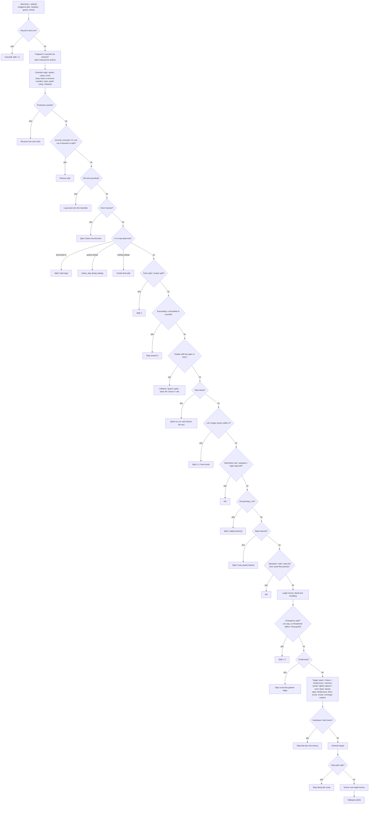

# What the code does: the v5.9 bot, part by part

This document explains the current bot, `v5.9/main.cpp` (about 6,700 lines) plus `v5.9/helper.hpp`, in full. It covers
what each part of the code does, why it is there, and how the parts combine into a strategy. References such as
`main.cpp:5045` point into `v5.9/main.cpp` as of 2026-09-29; they drift as the file changes, so the function name next
to each one is the reliable handle (`grep -n "void observe" v5.9/main.cpp`).

For each version, the `strategyV_*.md` files record *why* it changed and *what the benchmarks said*. This file describes
*what the code in the latest version actually does*. Where the two disagree, the code wins (and so does this file).

v5.9 is v5.8 plus three briefs: the six fixes of `strategyV_5_9.md` (ladder battle M488787), a second brief of twelve
items from the ladder replays `M510524`..`M514761` (portal probes, corridor lanes, retreat, move counts, sprint reach,
herding, and so on), and a kamikaze brief (exchange-value strikes and support positioning, from the PD replay). Code for
the second brief is marked `v5.9b` in comments and in this file, the kamikaze brief `v5.9c`.

---

## Contents

1. [The game in one page](#1-the-game-in-one-page)
2. [The strategy in one page](#2-the-strategy-in-one-page)
3. [Process model and the turn loop](#3-process-model-and-the-turn-loop)
4. [Configuration: constants and feature flags](#4-configuration-constants-and-feature-flags)
5. [Data structures (what a dragon remembers)](#5-data-structures-what-a-dragon-remembers)
6. [Geometry helpers](#6-geometry-helpers)
7. [Map-scaled thresholds](#7-map-scaled-thresholds)
8. [Roles and the dragon life cycle](#8-roles-and-the-dragon-life-cycle)
9. [`observe()`: building the picture every turn](#9-observe-building-the-picture-every-turn)
10. [Sonar: the only team channel](#10-sonar-the-only-team-channel)
11. [Pathfinding and spatial analysis](#11-pathfinding-and-spatial-analysis)
12. [Choosing targets](#12-choosing-targets)
13. [Combat](#13-combat)
14. [Every kind of split](#14-every-kind-of-split)
15. [Portals](#15-portals)
16. [Hazards, corridors, dead ends and farms](#16-hazards-corridors-dead-ends-and-farms)
17. [The endgame: one apex](#17-the-endgame-one-apex)
18. [Movement hygiene: loops, dispersion, repulsion, isolation, retreat](#18-movement-hygiene-loops-dispersion-repulsion-isolation-retreat)
19. [Map symmetry, hotspots, rendezvous and patches](#19-map-symmetry-hotspots-rendezvous-and-patches)
20. [`decide()`: the full priority cascade](#20-decide-the-full-priority-cascade)
21. [The movement scorer](#21-the-movement-scorer)
22. [Last-resort fallbacks](#22-last-resort-fallbacks)
23. [`execute()`: acting and talking](#23-execute-acting-and-talking)
24. [CPU budget and the zero-allocation style](#24-cpu-budget-and-the-zero-allocation-style)
25. [A game, start to finish](#25-a-game-start-to-finish)
26. [How the bot got here: version history and results](#26-how-the-bot-got-here-version-history-and-results)
27. [Known weak spots](#27-known-weak-spots)
28. [Glossary](#28-glossary)

---

## 1. The game in one page

The authoritative rules are in `unsw_battlecode_docs_llm_reference.md`. These are the ones the code depends on:

| Rule | Consequence for the code |
|---|---|
| The map is a **torus** (edges wrap), 10–64 tiles per side, and symmetric (180° rotation, x-mirror or y-mirror). | Every distance uses wrapped deltas (`delta`, `dist`, `chebyshev`). The bot infers the symmetry type itself (§19). |
| **Kelp** and **portals** are *edges* between tiles, not tiles. Crossing kelp kills. A portal edge teleports the head to its partner edge (same ID). | `Cell::edge[4]` stores each tile's four edges. `destination()` resolves portal jumps. |
| Each dragon sees only a **7×7** window around its head. It can't see through portals. | Everything outside the window comes from memory (`DragonState::cells`) or from sonar. |
| **Pearls** spawn on tiles on per-tile countdowns (visible, `get_pearl_time()`). Mirrored tiles share one countdown. Eating a pearl adds one segment. | Pearl timers drive foraging, chamber camping, farms, rendezvous and symmetry detection. |
| Moving into kelp, any body, or your own body (including your tail) kills. **Head-to-head** kills both dragons. | The safety checks (`is_step_safe`, `survival_moves`) and the kamikaze logic. |
| A dragon can't reverse into its own neck. | Every BFS forbids the backward edge on the first step, and pocket analysis looks for loops, not area. |
| **Sprint:** `k` moves in one turn cost `k−1` segments. After the first step each step needs length ≥3; a pearl eaten on a step adds a segment first. Over-sprinting kills. | Sprint kills, neck blocks, and (v5.9b) pearl-fed sprints both ways: ours (`pearl_sprint`) and the enemy's (`sprint_reach`). |
| **Split:** the rear `c` segments become a new dragon. Its head is the old tail, and it faces away from the parent. Both parts must be ≥2 long. At most 64 dragons per team. | The core economic tool (§14). `can_split()` checks legality. |
| A split child is a **new process** with a new sequential ID. It acts later in the **same round** and inherits no memory. | Anything the child needs to know has to reach it by sonar, usually a beam refracted out through the parent's tail. |
| Dragons act in **ascending ID order** each round. | This makes the round-0 cascade possible, and it sets sonar latency (a higher ID hears in the same round). |
| **Sonar:** up to 4 beams per turn (N/E/S/W), each carrying a 64-bit payload. A beam travels straight, wraps, passes through portals, and stops at kelp or at the first dragon part. The message has no sender ID or team. A beam fired into your own body refracts out through the tail. The sender gets aggregate **echo counts** (kelp / ally / ally head / enemy / enemy head) next turn. | The whole coordination layer (§10). Payloads carry a 2-bit team signature. v5.9b reads echoes for portal probes (§15.13). |
| **Death drops pearls:** on every second segment from the head, `ceil(L/2)` in total. | Feeders turn their bodies into pearls beside the apex (so a pearl eaten at even length is one more pearl dropped, §17). Kamikazes cost the team half their length. |
| **Win:** eliminate the other team. At round 500 the **longest single dragon** wins, then total length. | The whole endgame funnels mass into one dragon (§17). |
| **CPU points:** one per instruction, 100M per turn. Each stdout/stderr write costs about 2.5M. | Fixed arrays and bounded floods, with no debug output in real builds (§24). |

---

## 2. The strategy in one page

The bot runs an economy engine in three acts.

**Act 1: explode into many small dragons (round 0 onward).**
In round 0, every spawn body of length ≥4 splits its rear `L−2` again and again (the *round-0 cascade*). A long
starting dragon becomes L/2 two-long dragons before anyone has moved. From then on, any non-alpha that grows to length 4
splits off a 2-long child (the *routine split*), until the team passes `UNIT_CAP` (33) units. Small dragons are cheap,
spread the swarm across the map, and every one of them is another forager. Until `threshold()` (or `alpha_split_cap()`
units), even the alpha keeps splitting, so it works as a unit factory.

**Act 2: forage, hold ground, farm, and trade when ahead (mid game).**
Each dragon forages on its own. It picks visible pearls (`food_target`), then pearls due soon, then remembered pearls
(routed over the remembered map, through known portals), then rendezvous (clusters due to spawn together), farms, and
mirrored hotspots, and otherwise explores toward a sector waypoint pointing away from its birth side. It avoids dead
ends it can't turn in (except to farm them), tiles an enemy is forced onto, and crowding teammates. Portal chambers and
small enclosed pearl patches get one *camper* each. Fast-refilling dead ends (*farms*) are dived, split at the tip and
re-dived by 2-long children.

When the team's unit count passes a map-scaled threshold, or a newborn's ID shows the team is clearly ahead in units,
the *kamikaze regime* starts. Two-long dragons become kamikazes (they hunt and herd enemy heads for head-on trades,
approaching down the lane beside an enemy's path and ramming it from the side) and three-long dragons become sprint
hunters. Any non-alpha strikes an enemy head it can reach when the exchange pays the team (who eats the dropped pearls
counts as much as the lengths lost), and small hunters stand by teammates an enemy could ram. Two-long *skirmishers* ram any longer enemy head in reach even outside the
regime. Zero-loss kills (neck blocks, corridor traps) are taken whenever they are available. A dragon alone among
enemies takes only fair trades; one outnumbered on the enemy's half walks home (v5.9b).

**Act 3: consolidate into one apex (from `feed_round()`, about round 355 on most maps).**
Only the longest dragon counts at round 500. The alpha stops splitting after `threshold()` (it is *growing*). At
`feed_round()` (earlier, from round 250, for a dragon no enemy could reach for 150 rounds) every other dragon becomes a
*feeder*: it walks to the alpha that ends longest (length against distance) and kills itself beside it, leaving
`ceil(L/2)` pearls for the apex to eat. Weaker alphas merge upward. The apex walks toward incoming mass. Feeders only
die where the apex can reach the pearls, they hold off while it still has a pile to eat, and they never box it in.

The rest of the code (hazard broadcasts, portal reservations and probes, dead-cell barring, mantle handover, symmetry
scouting, corridor lanes) keeps that engine from jamming on specific map features. Most of those parts were added one
version at a time in response to traced failures in replays.

---

## 3. Process model and the turn loop

### 3.1 `helper.hpp` (the engine protocol, same file in every version)

`namespace unswbc` provides:

- `Controller`: this dragon's view. `get_length()`, `get_unit_count()`, `get_id()`, `get_team()`, `get_dir()`
  (head facing), `get_position()`, `get_tiles()` (the 49 visible tiles), `get_tile(pos)` (null outside the window),
  `get_sonar_messages()`, `get_sonar_echoes()` (kelp / ally / ally_head / enemy / enemy_head counts for last turn's
  beams), and the output commands `make_move`, `make_moves` (sprint), `can_split`, `do_split`, `send_sonar(dir, u64)`,
  and `set_indicator_string`.
- `Tile`: `has_pearl()`, `get_pearl_time()` (−1 means it never spawns), `get_dragon()` (a `DragonPart*`), and
  `get_edge(dir)` (`is_passable()`, `is_portal()`, `get_portal_id()`).
- `DragonPart`: `position`, `get_id()`, `get_team()`, `is_head()`, and `get_dir()`. A head faces where it is going. A
  body segment faces toward the next segment nearer the head.
- `init()`, `update()` and `end_turn()` run the protocol. The helper buffers stdout and flushes once per turn.

### 3.2 `main()` (`main.cpp:6669`)

```
init() -> make a Brain on the heap
while update():            // reads this turn's state from the engine
    try { a = brain->decide(); brain->execute(a); }
    catch (...) { move straight ahead }  // a bug never crashes the dragon
    end_turn()             // flush
```

Every dragon is its own OS process running this loop, so a `Brain` lives exactly as long as its dragon. A split child
starts a fresh process with an empty `Brain`. Because of the catch-all, a bug inside `decide()` shows up only as odd
movement, never as a crash.

### 3.3 One turn inside the Brain

1. **`decide()`** (`main.cpp:5000`) is a thin wrapper (v5.9b): it clears the planned portal probe, calls
   **`decide_core()`** (`main.cpp:5045`), and passes the result through **`probe_filter()`** (`main.cpp:5007`, §15.13).
   `decide_core()` calls `observe()` (update memory from vision and sonar, §9) and `paths()` (a BFS from the head,
   §11.1), then walks the priority cascade (§20) and returns an `Action`.
2. **`execute(action)`** (`main.cpp:6365`) prints the split or move, updates bookkeeping (portal crossings, sprint and
   straddle counters, mantle and handover, corridor lanes), chooses a payload for each of the four sonar beams, sends
   them, and sets the replay label (`Alpha:forage`, `Kamikaze:kill`, `Neutral:portal`, and so on).

`Action` (`main.cpp:310`) is `{moves, child, mode, intentional_death}`:
- `moves`: one direction, several (a sprint), or none. None means either a split, or "move straight ahead" if
  `child == 0`.
- `child`: the number of segments to split off (0 means no split).
- `mode`: a label used for the replay string and a little later logic. The values are `Disperse`, `Forage`, `Ambush`,
  `Escape`, `Portal`, `Reside`, `Return` (unused), `Feed`, `Split`, `Kill`, `Trapped`, `Block`, `Cascade`, `Rescue` and
  `Loop`.
- `intentional_death`: the move is a deliberate suicide (a feeder drop, a head-on kill, or a trapped last move). No
  sonar is sent on such a turn, because a dead dragon's beams are never cast.

---

## 4. Configuration: constants and feature flags

Every behaviour added since v5.2 sits behind a `constexpr bool F_*` switch (`main.cpp:35-263`), so each one can be
ablated on its own. The blocks are grouped by version; the table lists every flag with its current value.

### 4.1 Core constants

| Constant | Value | Meaning |
|---|---|---|
| `MAX_CELLS`, `BFS_Q` | 4096 | 64×64, the largest map. Every per-cell array has this size. |
| `SONAR_TTL` | 36 | Alpha reports older than 36 rounds are dropped. |
| `SONAR_ID_MASK` | 8191 | The 13-bit ID field. 8191 means "no alpha" (sentinel). |
| `REGIME_MIN_UNITS / REGIME_LEAD / REGIME_RATIO_X10` | 7 / 3 / 13 | The adaptive kamikaze trigger: ≥7 units, and a lead of 3 units or 1.3×. |
| `KAM_SMALL_X10 / KAM_LARGE_X10` | 7 / 5 | The kamikaze unit threshold is 0.7× (map scale <20) or 0.5× (≥20) of the base table. |
| `HAZARD_TTL`, `RESERVE_TTL`, `SMALL_ENCLOSURE` | 12, 30, 20 | Hazard lifetime, portal reservation lifetime, maximum tiles of a "small" chamber. |
| `MAX_HAZARDS`, `MAX_PEARL_MEM` | 8, 16 | Fixed table sizes. |
| `UNIT_CAP` | 33 | Above this many units non-alphas stop voluntary splits (`F_SPLIT_CAP`). |

### 4.2 Feature flags

✔ on, ✘ off. "Measured" notes the benchmark behind an off switch.

| Flag | On? | Added | What it does |
|---|---|---|---|
| `F_HAZARD` | ✔ | v5.2 | A trapped dragon broadcasts the mouth of its pocket. Teammates won't enter it. |
| `F_PORTAL_EVICT` | ✔ | v5.2 | Leave barren or crowded portal chambers, or die to free one. |
| `F_PORTAL_CLEAR` | ✔ | v5.2 | Don't loiter on tiles with a portal edge, where dragons pop out blind. |
| `F_PORTAL_RESERVE` | ✔ | v5.2 | Sonar reservations, so at most one dragon uses a small enclosure. |
| `F_DISPERSE` | ✔ | v5.2 | Soft repulsion from friendly bodies. Break single-file queues. |
| `F_CYCLE` | ✔ | v5.2 | Detect periodic movement and break out of it. |
| `F_FEED_ADAPT` | ✔ | v5.2 | Feeder length decides how big a pearl pile makes it wait. |
| `F_FEED_BACKOFF` | ✔ | v5.2 | Feeders circle while the apex already has a pile to eat. |
| `F_ALPHA_MEMORY` | ✔ | v5.2 | Alphas keep a 16-slot queue of pearls they saw. |
| `F_REPEL` | ✔ | v5.3 | A quadratic repulsion field between non-alpha heads. |
| `F_CYCLE2` | ✔ | v5.3 | Loop detection by counting distinct tiles, and a breakout away from the loop. |
| `F_PORTAL_FIX` | ✔ | v5.3 | Residency release, occupancy expiry, a near portal beats a rumour, blind portals count as exits. |
| `F_ALPHA_PORTAL` | ✔ | v5.3 | Before round 50, the alpha grabs a nearby free portal and hands over its role. |
| `F_STRADDLE` | ✔ | v5.3 | Never split while the body straddles a portal (but see `F_STRADDLE_SPLIT`). |
| `F_HANDOVER` | ✔ | v5.3 | An L−2 split passes the alpha role to the rear child. |
| `F_LONG_PORTAL` | ✔ | v5.3 | Dragons of length ≥8 stay out of portals. If forced, only a 2-long head goes through. |
| `F_HAZARD_RR` | ✔ | v5.3 | Relay every live hazard in rotation. |
| `F_FANOUT` | ✘ | v5.3 | A crowd of 3+ heads fans out. Measured worse. |
| `F_SPAWN_CASCADE` | ✔ | v5.4 | The round-0 cascade of L−2 splits. |
| `F_REVERSE_SPLIT` | ✔ | v5.4 | With no surviving move, split L−2 (the head dies, the rear lives), even across a portal. |
| `F_CAMP` | ✔ | v5.4 | Stay in a portal chamber while its pearls are due. |
| `F_PORTAL_LOOP` | ✔ | v5.4 | Pushed out of a tiny dense chamber, loop around the partner edge and go back in. |
| `F_CHAIN` | ✔ | v5.4 | Leave a chamber by a portal we didn't just use (chained rooms). |
| `F_PORTAL_TRAP` | ✔ | v5.4 | Never cross into a dead cell. Portals with dead cells get barred for the whole team. |
| `F_SKIRMISH` | ✔ | v5.4 | 2-long dragons ignore enemy risk and ram longer enemy heads. |
| `F_FEED_GATE`, `F_GATE_REACH` | ✔ | v5.4 | A feeder dies only beside a real, reachable, uncontested apex. |
| `F_TRUE_LEN` | ✔ | v5.4 | Track alphas' real lengths (v5.3 floored every report at 8). |
| `F_SURPLUS` | ✔ | v5.4 | Feeders the apex can't use yet take value trades instead. |
| `F_CHOKE` | ✔ | v5.5 | Dead ends and hazard mouths are gated (refined by `F_CHOKE2`). |
| `F_CAMP2` | ✔ | v5.5 | Exactly one camper per chamber (yield to a lower ID). Remembered spawn timers. |
| `F_BACK_HARVEST` | ✔ | v5.5 | Split a 2-long child onto pearls behind the tail. |
| `F_CASCADE_FIX` | ✔ | v5.5 | Every spawn body cascades in round 0, even a long "growing" one. |
| `F_MANTLE` | ✔ | v5.5 | An alpha's L−2 split hands the role to the larger rear child (sonar tag 8186). |
| `F_MANTLE_CASCADE` | ✘ | v5.5 | Pass the role down the round-0 cascade too. Measured: dilemma 0/16. |
| `F_MANTLE_PROMOTE` | ✘ | v5.5 | A feeder longer than its apex takes the role. Measured worse on slithery_fight. |
| `F_DRY_EVICT` | ✔ | v5.6 | Leave a chamber at once when nothing lies in it and nothing is due within 24 rounds. |
| `F_CHOKE_GREEDY` | ✔ | v5.6 | In a dead end with pearls ahead: keep eating, and split L−2 at the tip. |
| `F_REENTRY` | ✔ | v5.6 | A camper forced out through its portal walks straight back in. |
| `F_SYMMETRY` | ✔ | v5.6 | Infer the map's symmetry and share it on sonar. |
| `F_MIRROR_SCOUT` | ✔ | v5.6 | Report rich spots and their mirror images. Idle small foragers go there. |
| `F_CHOKE2` | ✔ | v5.7 | Any length may enter a dead end, but only for ≥2 live pearls (`CHOKE_MIN_PEARLS`). |
| `F_RENDEZVOUS` | ✔ | v5.7 | Remember clusters of tiles due to spawn together and be there on time (§19.5). |
| `F_SPLIT_CAP` | ✔ | v5.7 | No voluntary non-alpha split while the team has more than `UNIT_CAP` units. |
| `F_KAM_CAP` | ✘ | v5.7 | The kamikaze regime is exactly "more than `UNIT_CAP` units". Measured 46 vs 64/128. |
| `F_PROTECT` | ✔ | v5.7 | A suicide strike needs a teammate nearer the collision than any other enemy (by moves since v5.9b). |
| `F_ASSASSIN` | ✔ | v5.7 | Above the cap, long neutrals ram intruders near our crowd; small ones converge on the drop. |
| `F_BARREN` | ✘ | v5.7 | Barren zones on sonar; explorers stay out. Measured 67 vs 76/128. |
| `F_SPLIT_COOL` | ✔ | v5.7 | A newborn L−2 rear makes no voluntary split for 8 rounds. |
| `F_PORTAL_COST` | ✔ | v5.7 | Routes pay extra for tiles with a portal edge; loitering there costs more. |
| `F_SCOUT_NEAR` | ✔ | v5.7 | A mirrored spot only has to lie outside our view. |
| `F_HYBRID` | ✘ | v5.7 | Explore outward from the centre fanned by ID. Measured −8/128. |
| `F_TAIL_DROP` | ✔ | v5.7 | Back harvest also counts pearls beside the tail. |
| `F_ROUTE_MEM` | ✔ | v5.7 | Out-of-view targets are routed over the remembered map (`memory_bfs`, all map sizes). |
| `F_REM_COMMIT` | ✔ | v5.7 | Keep the remembered pearl we set off for (it used to flip between two). |
| `F_PAIR_SEP` | ✔ | v5.7 | Two teammates travelling side by side with nothing to eat split up. |
| `F_SECTOR_HASH` | ✘ | v5.7 | Exploration sectors by a hash of the ID. Measured neutral-to-worse. |
| `F_SCOUT_NEARER` | ✔ | v5.7 | Leave a scout spot to a nearer teammate in view. |
| `F_PORTAL_ROAM` | ✔ | v5.7 | Residency and our own occupancy expire; idle dragons may use portals again. |
| `F_CHAMBER_ONE` | ✔ | v5.7 | A teammate nearer the chamber portal, or crossing it now, has it. |
| `F_FEED_CLEAR` | ✔ | v5.7 | Endgame feeders never box the apex in; late feeders deliver instead of holding. |
| `F_CHOKE_LOOP` | ✔ | v5.7 | The rear of an escape split stays out of dead ends for a while (split chains on slithery). |
| `F_TAIL_BFS` | ✔ | v5.7 | Tail harvest finds the tail on the visible body and pearls reachable from it. |
| `F_HOTSPOT2` | ✔ | v5.7 | Report rich spots themselves (and mirrors); crowded dragons go to them. |
| `F_ISOLATED` | ✔ | v5.8 | Alone among enemies (no teammate head in view): only fair trades, avoid their reach (§18.5). |
| `F_FARM`, `F_FARM_SEEK`, `F_ROUTE_PORTAL` | ✔ | v5.8 | Farm dead ends that refill fast, share them, walk to them, route through known portals (§16.5). |
| `F_EARLY_KILL` | ✔ | v5.8 | From round 1, a sure kill on an enemy at least as long, with a teammate near the collision. |
| `F_CHAMBER_MIRROR` | ✔ | v5.8 | A camper reports the mirror image of its chamber's outside entrance. |
| `F_FEED_SCORE` | ✔ | v5.8 | Feed the alpha that ends longest (length against distance); alphas merge upward. |
| `F_STRADDLE_SPLIT` | ✔ | v5.8 | A 2-split is fine with the body across a portal. |
| `F_PORTAL_YIELD` | ✔ | v5.8 | A portal a teammate is taking or just took is not waited at. |
| `F_POCKET_SEEK` | ✔ | v5.8 | Dense patches of good spawners count as rich spots before pearls pile up. |
| `F_PATCH_CAMP` | ✔ | v5.8 | One dragon per small enclosed pearl patch, not only portal chambers (§19.6). |
| `F_TRAP_AVOID` | ✔ | v5.8 | Long dragons score moves by the room left, counting our body as it frees up (`escape_room`). |
| `F_FEED_UNGUARD` | ✔ | v5.8 | A new alpha feeds a clearly longer apex at once. |
| `F_SECTOR_FLIP` | ✔ | v5.8 | Exploration waypoints point away from where we were born. |
| `F_FARM_SPLIT`, `F_QUICK_FARM` | ✔ | v5.9 | Out of a dead end we farmed, split 2 while longer than 4; spawners refilling within 5 rounds count. |
| `F_EARLY_FEED` | ✔ | v5.9 | No enemy able to reach us for 150 rounds: start feeding from round 250. |
| `F_EARLY_KILL2` | ✔ | v5.9 | Sure kills on enemies 1–2 shorter too, with a teammate right beside the collision. |
| `F_ENEMY_CHAMBER` | ✔ | v5.9 | A chamber we saw an enemy come out of (or go into) is left alone for 100 rounds. |
| `F_EXIT_CLEAR` | ✔ | v5.9 | Keep off the outer tiles of small-chamber portals: whoever leaves lands there blind. |
| `F_TRAP_SMALL`, `F_EVICT_EXIT` | ✔ | v5.9 | Room-aware moves for short dragons too; an evicted dragon may step onto its chamber's portal tile. |
| `F_RETREAT` | ✔ | v5.9b | Outnumbered on the enemy's half of the map: walk back toward our spawn (§18.6). `RETREAT_MODE` 2. |
| `F_PORTAL_PROBE` | ✔ | v5.9b | One beam through a portal before crossing it; its echo says who is behind (§15.13). |
| `F_PROBE_SPLIT` | ✔ | v5.9b | Forced out through a portal an enemy stands behind: split instead. |
| `F_PROBE_EXIT_FREE` | ✘ | v5.9b | With probes on, drop the exit-lane penalty (ablation). |
| `F_TRUE_MOVES` | ✔ | v5.9b | Who is nearer a pearl or a drop counts moves (walls, facing), not straight-line distance. |
| `F_BODY_FREE` | ✔ | v5.9b | Routes may cross our own body where it will have moved off by then. |
| `F_SPLIT_ONCE` | ✔ | v5.9b | A fresh split child whose own child would have no way out does not split again. |
| `F_MOUTH_CLEAR` | ✔ | v5.9b | Keep off the mouth of a dead end a teammate is in, however many pearls it holds. |
| `F_PEARL_SPRINT` | ✔ | v5.9b | Our strikes may sprint further by eating pearls on the way. |
| `F_FEED_EFF` | ✔ | v5.9b | Feeders grab an adjacent pearl at even length (their drop grows by one). |
| `F_HERD` | ✔ | v5.9b | Hunters step where the enemy they close on has the fewest safe replies. |
| `F_LONG_GUARD` | ✔ | v5.9b | Long non-alphas (≥6) weigh enemy reach and split away from it, as alphas do. |
| `F_LANE` | ✔ | v5.9b | One-way corridors: a dragon in one beams along it; teammates keep out (§16.4). |
| `F_ENEMY_LEN` | ✔ | v5.9b | Remember enemy lengths seen whole; a half-seen enemy is not assumed 4 long. |
| `F_EXCHANGE` | ✔ | v5.9c | A non-alpha strikes (one step, sprint, pearl-paid sprint) when the exchange pays the team (§13.4). |
| `F_SUPPORT` | ✔ | v5.9c | Small hunters stand by a teammate an enemy can ram, when we would lose the race to the drop (§13.4). |
| `F_FLANK` | ✔ | v5.9c | Kamikazes approach down the lane beside an enemy's path and ram from the side (§13.4). |
| `F_DODGE` | ✔ | v5.9c | Non-hunters weigh an enemy strike that would pay the enemy on the tile they step to (light: weight 15). |
| `F_EXCH_OUTNUM` | ✔ | v5.9c | Skip a strike where their heads outnumber ours near the collision (§13.4). |
| `F_DROP_LEARN` | ✔ | v5.9c | Learned drop share (better trades; wins equal to without it over 192 games) (§13.4). |
| `F_COLLECT` | ✘ | v5.9c | Hunters eat fresh drops first. Measured worse (§13.4). |

Tuning numbers that belong to these modules are defined next to their flags. The ones most often referred to:
`REPEL_W = 3`, `LONG_PORTAL_LEN = 8`, `ALPHA_PORTAL_ROUND = 50`, `FRIEND_PORTAL_TTL = 40`, `PORTAL_RESIDENCY = 4`,
`CAMP_HORIZON = 30`, `LOOP_CHAMBER = 8`, `CHAIN_PENALTY = 12`, `MANTLE_GUARD = 40`, `DRY_HORIZON = 24`,
`CHOKE_MIN_PEARLS = 2`, `SPLIT_COOL = 8`, `DEADEND_COOL = 40`, `FARM_MIN = 3`, `ISO_RADIUS = 5`, `ISO_RISK = 360`,
`ISO_RISK_EARLY = 320`, `ISO_MIN_LEN2 = 3`, `TRAP_MIN_LEN = 5`, `TRAP_NEED = 14`, `PEACE_WINDOW = 150`,
`EARLY_FEED_ROUND = 250`, `EXIT_LANE_PENALTY = 150`, `SPRINT_REACH = 1`, `RETREAT_TTL = 15`, `RETREAT_ENEMIES = 2`,
`PROBE_RANGE = 3`, `LONG_GUARD_LEN = 6`, `HERD_RANGE = 4`, `FEED_SHIFT = 0`, `EXCH_MIN = 0.5`, `EXCH_FAR = 6`,
`SUPPORT_MAX_LEN = 3`, `SUPPORT_RANGE = 4`, `DODGE_W = 15`, `DODGE_DIRECT = 2`, `FLANK_AHEAD = 4`, `FLANK_LINE_PENALTY = 35`,
`DROP_TTL = 30`, `DROP_PRIOR = 8`, `COLLECT_RANGE = 4`.

`BOT_DIAG`: if defined at compile time, the `DIAG(...)` macro writes trace lines (`cascade`, `rescue`, `camp`,
`farmfound`, `probe`, `lanesend`, `retreat`, `herd`, and many others) to `std::clog`. It is compiled out of real
builds, because each write costs 2.5M CPU points. Build a scratch copy with `#define BOT_DIAG` on top and run
`unswbc run -v`.

---

## 5. Data structures (what a dragon remembers)

### 5.1 `Cell` (`main.cpp:317`): one per map tile, kept for the whole game

| Field | Meaning |
|---|---|
| `seen` | The last round this tile was in view (−1 means never). `seen == round` means it is visible now. |
| `visited` | The last round our head stood here (−10000 means never). Used by the anti-cycling penalties. |
| `pearl_round` | When a pearl is expected here: `round` if one lies on it, `round + countdown` if the countdown is 1–14, else −1. Set to −1 while a dragon stands on it. |
| `spawn_at` | (v5.5) The round of the next spawn attempt as last seen (−1 means never or unknown). Lets chamber tiles out of view still count. |
| `fast_obs` | (v5.5) Consecutive sightings with a countdown ≤1: tiles that refill every round (farms). |
| `quick_obs` | (v5.9) Consecutive sightings with a countdown ≤5 (`F_QUICK_FARM`). |
| `sym_t`, `sym_done` | (v5.6) Absolute round of the next spawn as last seen (the symmetry evidence), and one bit per candidate already counted. |
| `held_until` | (v5.8) A teammate camps the pearl patch this tile belongs to (`F_PATCH_CAMP`). |
| `has_dragon` | A dragon segment was on it when last seen. |
| `edge[4]` | Per direction: −2 unknown, −1 kelp, 0 open, `id+1` a portal with that ID. Walls never change, so this memory is exact once seen. |

### 5.2 `Portal` (`main.cpp:329`)

`id`; `ends` (up to two canonical endpoints, see `canonical()` in §6); `occupied` / `occupied_until` (a teammate is
behind it); `reserved_until` / `reserved_by` (a sonar reservation); `small` (a small sealed chamber lies behind it);
`barren` (it leads nowhere useful; permanent, "never enter"); `shun_until` (we just left it: don't bounce back);
`trap_checked` (dead-cell analysis done); `enemy_until` (v5.9: an enemy holds the chamber behind it).

### 5.3 Other records

- `Hazard {p, dir, origin}`: stepping onto `p` while moving in `dir` walks into a pocket a teammate is trapped in. v5.9b
  reuses the same record as a timed *mark* (`origin` = last round it holds) for corridor lanes and probe exits.
- `PearlMemory {p, seen}`: an entry in the alpha's pearl queue.
- `Scout {p, origin, value, claimed, claim_round}`: a rich spot or its mirror image (§19.3).
- `Rendezvous {p, t, value}`: (v5.7) a cluster of tiles due to spawn around round `t`.
- `BarrenZone {p, until}`: (v5.7, unused while `F_BARREN` is off).
- `Farm {p, dir, value, seen, spec, claim_round, claim_id}`: (v5.8) a fast-refilling dead end: a fast spawner in it,
  the direction we step in by, how many fast spawners, whether it is a guessed mirror image, and who claimed it.
- `AlphaTrack {id, seen, len, p}`: a friendly alpha known from sight or sonar.

### 5.4 `DragonState` (`main.cpp:386`): everything private to this dragon

These groups are the dragon's whole "mind":
- **Role:** `alpha`, `growing`, `resident`, `evacuating`, `dispersing`, `camping`, `hunter_until`, `primary_demoted`,
  `mantle_round` / `mantle_from` / `mantle_send`, `patch_camp`.
- **Life:** `born`, `born_len`, `home` (birth tile), `last_food`, `last_mode`, `threat_round` (last round an enemy head
  could reach us, `F_EARLY_FEED`).
- **Exploration:** `sector`, `sector_target`, `explore_timer`, `recent_path` (the last 24 head positions),
  `cycle_break_until`, `crowd_turns`, `fanout_until`, `heading` (hybrid), `pair_turns`, `rem_goal` / `rem_until`.
- **Enemy intel:** `enemy_alpha_pos`, `enemy_alpha_seen`, `kamikaze_signal_round`, `elen_mem[16]` (v5.9b: enemy ID,
  length seen whole, round).
- **Hazards and corridors:** `enc_mouth`, `enc_dir`, `enc_round`, `hazards[8]`, `hazard_sent`, `hazard_rr`,
  `deadend_until`, `hist[64]` / `hist_n` (our body, tail first), `farm_recent`, `lanes[6]` and `lane_dir` /
  `lane_end` / `lane_steps` (v5.9b).
- **Portals:** `home_portal`, `pending_portal`, `portal_arrival`, `evicting`, `contend_portal` / `contend_round`,
  `send_reserve` / `send_clear`, `capture_portal` / `capture_until`, `chamber_portal` / `chamber_round` /
  `chamber_size`, `loop_portal` / `loop_until`, `dead_alarm`, `news_portal` / `news_until`, `used_portals[4]`,
  `camp_portal` / `camp_since` / `camp_round` / `camp_seen[8]`, `dry_portal`, `transit_portal`, `reclaim_portal` /
  `reclaim_until`, `camp_tiles`; v5.9b probe state `probe_pos` / `probe_dir` / `probe_round` / `probe_verdict` /
  `probe_bounded` / `probe_plan_*` and `avoid[4]` (exit tiles a teammate is about to come out on).
- **Splitting:** `straddle_left`, `moved_len`, `moved_steps`, `moved_cross`, `harvest_round`, `sprint_round`,
  `farm_harvest_round`.
- **Alpha bookkeeping:** `alphas`, `demoted[8]`, `handover_to` / `handover_old` / `handover_round`, `mantle_child_len`,
  `pearl_mem[16]`, `feed_id` (the alpha we are feeding).
- **Symmetry, scouting, rendezvous, farms, patches:** `sym`, `sym_score[4]`, `sym_strong[4]`, `sym_bad[4]`,
  `scouts[4]`, `scout_sent`, `scout_new`, `goal`, `goal_until`, `claim_send`, `pearl_ema`, `n_seen`, `n_never`,
  `n_kelp`, `n_good`, `rdv[6]`, `rdv_goal`, `farms[8]`, `farm_goal`, `farm_new`, `farm_birth`, `patch_*`.
- **Spawn side (v5.9b):** `spawn`, `spawn_known`, `retreat_until`.
- **Drops (v5.9c):** `drops[24]` (death-drop pearls we saw appear, and when), `drop_us` / `drop_them` (who ate the ones
  we saw eaten).
- **Map memory:** `cells[4096]`, `portals`, `previous_heads`.

### 5.5 `Brain` scratch (`main.cpp:506`)

Per-turn arrays: `distance`, `first` (first step of the shortest path), `predecessor`, `arrival` (direction of the last
step into the tile), `wcost` / `wfirst` (portal-averse route, §11.1), `mem_depth` / `mem_first` / `mem_q` (routes over
the remembered map), `risk_cache` (memoised `danger()`), `danger_depth`, `space_seen`, `remembered_first` /
`remembered_q` (queues for the smaller floods), `farm_q` / `farm_dep` (the last dead-end region), and `mm_cache` (v5.9b:
up to 10 move-count maps of other dragons, §11.9). `friends` and `enemies` hold the visible heads, sorted by ID.
`friend_len_cache` and `enemy_len_cache` count visible segments per dragon ID. `friend_alpha_cache` holds the visible
friends that count as alphas. `iso` / `iso_early` hold this turn's isolation state.

Several of these arrays are filled with −1 / false once, in the constructor. Each flood resets only the entries it
touched, so no turn pays to clear 4,096 cells more than once (§24).

---

## 6. Geometry helpers

(`main.cpp:546-638`)

- `index(p) = y·w + x`. `wrap(p)` takes coordinates modulo the map size. `step(p, d)` moves one tile with wrap.
- `delta(a, b, size)`: the signed shortest offset on a ring, in `(−size/2, size/2]`.
- `dist`: wrapped Manhattan distance. `chebyshev`: wrapped Chebyshev distance (the 7×7 view is `chebyshev ≤ 3`).
- Directions are indexed 0 = N, 1 = E, 2 = S, 3 = W (`DIRS`). `di(Direction)` converts back. The reverse of `d` is
  `(d+2)%4`.
- `canonical(p, d)`: an edge is shared by two tiles, so it is normalised to (tile, N) or (tile, W): a south edge
  becomes the north edge of the tile below, and an east edge becomes the west edge of the tile to the right. Portal
  endpoints are stored this way, so both sides of an edge match.
- `destination(p, d)`: where the head lands when it moves `d` from `p`. For kelp or an unknown edge it returns nothing.
  For an open edge it is `step(p, d)`. For a portal it finds the partner endpoint: moving N or W you land one step past
  the partner's canonical tile, and moving S or E you land on it. It returns nothing if the partner was never seen. The
  head keeps its direction through a portal, and so does a sonar beam.
- `empty(p)`: visible **this** round and no dragon on it.
- `mirror(p, k)` and `mirror_dir(d, k)`: the image of a tile or direction under symmetry candidate `k` (rotation,
  x-mirror, y-mirror, or diagonal on square maps). `side_sym()` (v5.9b) is the resolved symmetry, or the first
  candidate not yet ruled out.

---

## 7. Map-scaled thresholds

Everything size-dependent keys off `map_scale()` (`main.cpp:714`). Since v5.7 (`SCALE_MODE = 1`) it is
`(W + H) / 2`: travel on a torus is Manhattan, so mean distances grow with `W + H`, which `sqrt(W·H)` understated on long
maps (autarky 54×18: 36 against 31).

| Function | Formula | Used for |
|---|---|---|
| `base_kamikaze_threshold()` | 5 (n≤12), 10 (<20), 18 (≤26), 28 (≤31), 18 (≤35), 26 (≤50), 48 | v4.14's table |
| `kamikaze_threshold()` | base × 0.7 (n<20) or × 0.5 (n≥20) | A unit count above this puts the team in the kamikaze regime |
| `alpha_split_cap()` | 42 / 36 / 24 / 18 / 12 / 8 (n ≤12, <20, ≤26, ≤35, ≤50, above) | At this many units the alpha stops splitting |
| `threshold()` | clamp(480 − 6n, 120, 410) | The round after which the alpha stops splitting and grows |
| `feed_round()` | min(415, 500 − 1.5n − 25) − 60 − `FEED_SHIFT` | Start of the endgame consolidation |

On the current map set (`maps/maps/`):

| Map | Size | Declared symmetry | n | kamikaze units | alpha split cap | alpha grows after | feed round |
|---|---|---|---|---|---|---|---|
| arena | 11×11 | xy | 11 | 3 | 42 | 410 | 355 |
| small (invalid, <10 high) | 16×8 | xy | 12 | 3 | 42 | 408 | 355 |
| Colosseum, default_small | 16×16 | xy | 16 | 7 | 36 | 384 | 355 |
| devil | 32×16 | y | 24 | 9 | 24 | 336 | 355 |
| dilemma, portals | 32×16 | xy | 24 | 9 | 24 | 336 | 355 |
| trophy | 25×25 | y | 25 | 9 | 24 | 330 | 355 |
| queen_of_spades (+ _ages) | 25×35 | xy | 30 | 14 | 18 | 300 | 355 |
| default | 32×32 | xy | 32 | 9 | 18 | 288 | 355 |
| autarky | 54×18 | xy | 36 | 13 | 12 | 264 | 355 |
| stronghold, trauma | 48×24 | xy | 36 | 13 | 12 | 264 | 355 |
| slithery_fight | 63×27 | xy | 45 | 13 | 12 | 210 | 348 |
| schooltime | 60×40 | y | 50 | 13 | 12 | 180 | 340 |
| help, big_empty | 64×64 | xy | 64 | 24 | 8 | 120 | 319 |

"xy" in the map file means 180° rotation, and "y" means x → W−1−x (see §19). The ladder pool is every map except small,
arena, Colosseum and default_small.

---

## 8. Roles and the dragon life cycle

There is no single "role" field. A dragon's behaviour comes from a handful of flags plus its length.

### 8.1 Birth: `initialize()` (`main.cpp:1841`)

On a dragon's first turn:
- It records `home`, `born`, `born_len`, and `threat_round = round` (a newborn has seen no enemy yet). In round 0 it
  also records `spawn` (v5.9b, §18.6); later dragons learn the spawn from `SPAWN_TAG` packets.
- `alpha = is_primary_alpha_id(id)`. The team's starting dragon (ID 0 for team A, 1 for team B) is the **primary
  alpha**, unless `primary_demoted` has been heard.
- With `F_HANDOVER`, a child born after round 0 with length ≥4 (only an L−2 split produces one) also becomes alpha,
  unless it was born into a sealed pocket. It records `mantle_round`, which starts the 40-round feed guard.
- `F_CHOKE_LOOP`: a child born ≥4 long after round 0 (the rear of an escape split) stays out of dead ends for 40 rounds
  (`deadend_until`), unless a farm pays (§16.5).
- `evacuating = !alpha && id > 1 && enclosed_nursery()`: born in a sealed nursery with a portal, it must leave.
- The dragon picks its exploration sector `(id/2) % 8` and a waypoint (§12.5), resets its ring buffers and runs
  `check_adaptive_kamikaze()`.

### 8.2 The roles

| Role | How you get it | What it means |
|---|---|---|
| **Alpha** | The primary ID, promotion (length >7, except in round 0), an L−2 split child of ≥4 (handover), a mantle claim, a handover packet naming you, or the apex election | The dragon that should end the game long. Every turn it broadcasts its own position and length on all four beams. It never runs `guaranteed_kill` and it weighs `danger()`. |
| **Growing** | Alpha: `round > threshold()` or `units ≥ alpha_split_cap()`. Non-alpha: `round ≥ 380 && units ≥ 14` | No routine splitting: keep the mass. |
| **Small-map splitting alpha** | Alpha with `map_scale < 20` and not growing | Behaves like a neutral dragon (no danger penalties, can use portals, centre bonus) while it produces units. |
| **Neutral / forager** | Everyone else | Forages, splits at 4, explores, farms. |
| **Long guard** (v5.9b) | Non-alpha, not feeding, not a kamikaze, length ≥6 | Weighs `danger()` like an alpha and splits L−2 away from a head that can ram it. |
| **Kamikaze** | `is_kamikaze()`: non-alpha, not growing, length 2, kamikaze regime active. Or any non-alpha of length ≤3 within `hunter_until` | Takes every valid head-on trade, herds and ambushes enemy heads, hunts the enemy alpha via sonar, ignores the enemy "certain death" filter (but not dead ends). |
| **Sprint hunter** | The same, but length 3 | Takes high-value kills, and normal kills when no pearl is in view. |
| **Skirmisher** | Any non-alpha of length 2 (`F_SKIRMISH`) | Ignores the certain-death filters and rams any enemy head of visible length ≥3 (or ID 0/1) it can reach this turn. |
| **Assassin** (v5.7) | Over the unit cap, a neutral ≥5 long with ≥2 non-alpha teammates within 5 | Rams (or sprints into) an intruding enemy head when the trade pays with our crowd eating both drops. |
| **Isolated** (v5.8) | No teammate head in view and an enemy head within 5, length ≥3 (`ISO_MIN_LEN2`) | Only fair trades; pearls and steps an enemy can reach are refused or penalised (§18.5). |
| **Resident** | Came through a portal and stayed | Won't use other portals. Lives off the zone it came into (§15.2). |
| **Camper** | Holds a paying portal chamber (`F_CAMP2`) or a small pearl patch (`F_PATCH_CAMP`) | Stays, reserves the portal, and is exempt from feeding until round 495. |
| **Evacuee** | Born in a sealed nursery | Goes straight for the nursery's portal, ignoring occupancy. |
| **Feeder** | From `feed_round()` (or the early-feed round), any non-receiver with a reachable superior alpha | Walks to the apex and dies beside it. |
| **Apex / receiver alpha** | An alpha with no superior alpha reachable in time | Eats the feeders' pearls and walks toward incoming mass. |

### 8.3 The kamikaze regime

`check_adaptive_kamikaze()` (`main.cpp:1825`) reasons from IDs. IDs come from one global counter shared by both teams,
so when our dragon is born its ID equals the total number of dragons spawned so far. Our team has `unit_count` alive,
so the enemy has at most `enemy_max = id − my_units` dragons. If
`my_units ≥ 7 && (my_units − enemy_max ≥ 3 || (my_units ≥ 10 && 10·my_units ≥ 13·enemy_max))`, the team is ahead, and
this dragon sets `kamikaze_signal_round = round`. The check runs only in a dragon's first two rounds of life, and never
in rounds 0–1, because the round-0 cascade creates a unit lead without a mass lead. Independently,
`unit_count > kamikaze_threshold()` also sets it, every turn.

The signal spreads through the 3-bit `kam_bucket` field of every sonar packet (§10). It stays active for 28 rounds while
the team has ≥6 units. `is_kamikaze_regime()` is true before `feed_round()` when either condition holds. An isolated
dragon (§18.5) is never treated as a kamikaze.

---

## 9. `observe()`: building the picture every turn

`main.cpp:2006`. In order:

1. **Reset per-turn state:** `round`, `here`, the friend and enemy lists, `risk_cache`. If our head is on a pearl,
   `last_food = round`.
2. **Scan the 49 visible tiles.** For each tile: on first sight update the map statistics (`n_seen`, `n_never`,
   `n_kelp`, `n_good`); set `seen`, `has_dragon`, `spawn_at`, `fast_obs`, `quick_obs`, `sym_t` and `pearl_round`;
   record all four edges (every portal edge adds its canonical endpoint to the portal's `ends`, which links partners);
   count visible segments per dragon ID; collect friend and enemy **heads**.
3. **`observe_symmetry()`**, `find_barren()` (off), **`find_rendezvous()`**, **`find_farms()`**, and the running mean of
   pearls in view (`pearl_ema`).
4. **Dead-portal scan** (`F_PORTAL_TRAP`): every visible portal edge not yet judged gets `dead_cell()` on both sides.
   Dead on both sides: the portal is permanently `barren` and `occupied`, and the news is queued for sonar.
5. Clear `pearl_round` under every visible head. Sort friends and enemies by ID. On the first turn, `initialize()`.
   Then `check_adaptive_kamikaze()` and `track_body()` (our body, tail first, `F_CHOKE_LOOP`).
6. **Enemy lengths** (v5.9b, `F_ENEMY_LEN`): an enemy whose whole body is in view has its length remembered.
7. **Probe echo** (v5.9b, §15.13): if last turn we fired a probe from where we still stand, read this turn's echo counts
   into `probe_verdict` (0 clear, 1 ally, 2 enemy) and `probe_bounded`.
8. **Enemy alpha sighting:** a visible enemy head whose ID is ≤1 or with ≥6 visible segments sets `enemy_alpha_pos`.
9. **Decode sonar** (§10.3).
10. **Visible friendly alphas:** refresh their tracks (vision never shrinks a tracked length).
11. **Portal occupancy inference:** a friend head whose *back* edge is a portal, and that moved since last turn, has
    just come out of that portal: mark it occupied (40 rounds, or for good if the chamber is small).
12. **Enemy chambers** (`F_ENEMY_CHAMBER`): an enemy head just out of a portal, or a segment crossing one, with a small
    chamber behind it: that chamber is theirs for 100 rounds.
13. Drop alpha tracks older than 36 rounds. **Promotion** of non-alphas longer than 7. Rebuild `friend_alpha_cache`.
14. **Apex election:** from `feed_round() − 5`, if no alpha is known and we are the longest visible friend (lower ID
    breaks ties), at least 4 long, and haven't handed the role away in 30 rounds, we become alpha and growing.
15. **Exploration bookkeeping:** advance the sector (+3 mod 8) when the waypoint is within 3, on a timeout, or when our
    tile repeats in `recent_path`.
16. **Corridor-entry tracking** (`F_HAZARD`): stepping from a tile with ≥3 passable edges onto one with ≤2 records
    `enc_mouth` / `enc_dir`.
17. Mark `visited`, push `here` onto `recent_path` (24). **Loop detection** (§18.1).
18. **Portal arrival processing**, if last turn's `execute()` set `pending_portal`:
    - Record the crossing in `used_portals`. A dead cell on arrival bars the portal (`dead_alarm`).
    - If we were **evicting**, release the portal (a dry chamber is reserved in our name instead) and stop residing.
    - Otherwise mark it occupied (for `FRIEND_PORTAL_TTL` outside small chambers) and become a **resident**, unless
      the residency rule releases us (§15.2), we came out of a dense tiny chamber (portal loop), or we were a camper
      forced through (re-entry).
19. **Growing flag** (§8.2). Alphas update their **pearl memory** (`remember_pearls`).
20. **`track_straddle()`**: how many segments are still on the far side of a portal, from last turn's move and the
    length change (a pearl just past a portal is invisible at execute time).

---

## 10. Sonar: the only team channel

### 10.1 The 64-bit packet (`alpha_packet64`, `main.cpp:917`)

```
bit 63..62  sig        team signature: 1 = team A, 2 = team B (enemy packets are ignored)
bit 61..49  aid        13 bits: friendly alpha ID, or a TAG (8180..8191)
bit 48..40  r          origin round (0..511)
bit 39..34  px         6 bits x  \  alpha position, or a tag's payload
bit 33..28  py         6 bits y  /
bit 27..20  alen       8 bits: alpha length, or a tag's payload
bit 19      he         enemy alpha seen within 12 rounds
bit 18..13  ex         enemy alpha x
bit 12..7   ey         enemy alpha y
bit  6..4   kam_bucket 0 = regime off; else 1 + min(6, signal_age/4)
bit  3..0   eage       age of the enemy-alpha sighting (0..15)
```

The low 20 bits (enemy alpha and kamikaze bucket) are filled in **every** packet, tagged ones included, except
`BARRED_TAG`. So enemy intelligence and the kamikaze regime ride on whatever else is being said.

### 10.2 The tags (special values of `aid`)

| aid | Name | Payload | Sent by | Effect on the receiver |
|---|---|---|---|---|
| 8191 | "no alpha" sentinel | none | A non-alpha that knows no alpha but has enemy-alpha or kamikaze news | Only the low 20 bits are used |
| 8190 | `HAZARD_TAG` | pos = pocket mouth; alen = entry dir \| 4 | A trapped dragon, then relays | `add_hazard`. The mouth is closed (§16.1) |
| 8189 | `PORTAL_TAG` | pos = sender ID; alen = portal id (5b) \| small \| barren \| clear | Portal users, campers, evictors | Marks small or barren, sets a reservation, or clears it |
| 8188 | `HANDOVER_TAG` | pos = successor ID (4095 = none); alen = old alpha ID | An alpha that gave up its role | Drops the old alpha's track; the named successor becomes alpha |
| 8187 | `BARRED_TAG` | low 32 bits = bitmask of barred portal IDs | Anyone who knows a barred portal | Marks every set portal barren and occupied, permanently |
| 8186 | `MANTLE_TAG` | pos = old alpha ID; alen = child length (0 = relay) | An alpha whose split child takes the role | Everyone demotes the old ID; the newborn of exactly that length claims alpha |
| 8185 | `SCOUT_TAG` | pos = spot; alen = sym (2b) \| value (4b) \| sym unknown (bit 6) \| claimed (bit 7) | A dragon that found a rich spot, or knows the symmetry | Learns the symmetry, adds or claims the spot |
| 8184 | `BARREN_TAG` | pos = zone centre; alen = sym \| valid \| ttl/4 | (off with `F_BARREN`) | A barren zone and its mirror |
| 8183 | `FARM_TAG` | pos = a fast spawner in the farm; alen = entry dir (2b) \| fast spawners (4b) \| speculative mirror (bit 6) \| claimed (bit 7) | A dragon that found or claims a farm; a rescue split into a farm (to its child) | `note_farm`; a newborn told by its parent knows it was born at a farm tip |
| 8182 | `LANE_TAG` (v5.9b) | pos = far end tile of a corridor; alen = sender heading (2b) \| rounds until out (5b) | A dragon walking a straight one-way corridor, on the beam ahead | Nobody steps onto that tile heading into the corridor until then (§16.4) |
| 8181 | `PROBE_TAG` (v5.9b) | pos = the tile the sender comes out on | The portal probe beam (§15.13) | Whoever the beam hits (a teammate beyond the portal) keeps off that tile for 2 rounds |
| 8180 | `SPAWN_TAG` (v5.9b) | pos = one of our round-0 positions | Any dragon that knows it, one beam every 5 rounds | Dragons born later learn which half of the map is ours (§18.6) |

Real dragon IDs never get near 8180 (under 2,000 even on slithery_fight).

### 10.3 Decoding (`observe()` + `decode_tag()`, `main.cpp:1879`)

For each message with our team signature:
1. `BARRED_TAG`: set the bits, queue the news if any is new, and skip the rest (this packet has no other fields).
2. `kam_bucket > 0` gives an estimated signal origin of `round − 4·(bucket−1)`. If that is newer than our own, it is
   adopted.
3. `he` set: adopt the enemy-alpha position if its sighting round is newer than ours.
4. Tagged: hand the packet to `decode_tag()` and skip alpha tracking.
5. Otherwise it is an alpha report. Skip our own ID and anything older than 36 rounds, then `remember_alpha(id, pos,
   origin, max(2, alen))`. A newer report replaces the length (a split shows up as a shrink); in the same round the
   larger length is kept. Reports about a demoted ID from before its demotion are ignored.

`decode_tag()` handles each tag as in the table: MANTLE (demote, and the newborn of that length born this round claims
alpha), HANDOVER (demote, claim if targeted, else relay for 8 rounds), HAZARD (≤12 rounds old), PORTAL (sticky small and
barren bits, clear, or reservation with the lower ID winning a contest), SCOUT (adopt the symmetry unless bit 6 says it
is unknown or it is contradicted, then `note_scout`), FARM, and the three v5.9b tags (`add_mark` into `lanes` or
`avoid`, or learn `spawn`).

### 10.4 What gets sent (full detail in §23.3)

By default an alpha sends its own fresh packet on all four beams. A non-alpha multiplexes the known alphas (in the
endgame the longest first, so feeders hear of the apex), one per beam. Tagged packets then *take over* beams: urgent
ones take all four, routine ones rotate through beam `(round + i) % 4`. A corridor lane takes the beam ahead, and a
portal probe goes out **alone** (every other beam dropped) so the next turn's echo counts are its own.

---

## 11. Pathfinding and spatial analysis

### 11.1 `paths()`: the main BFS (`main.cpp:2701`)

A BFS from the head over **visible** tiles only, through open edges only (no portals). It never takes the backward edge
on the first step, never enters a closed chokepoint (`chokepoint_blocked`) and (v5.9b) never enters a corridor a
teammate is coming along (`lane_blocked`). A tile holding a dragon part is not entered, except:
- an enemy **head**, which is recorded (so kills can target it) but not expanded;
- (v5.9b, `F_BODY_FREE`) one of **our own** segments that will have moved off by the time we get there: segment `j`
  from the head is gone after `L − j` moves, so it is passable when reached at depth `> L − j`. The BFS used to treat
  our tail as a wall (autarky round 112: a pearl just past our own tail looked 11 steps away and was left).

It fills `distance[i]`, `first[i]` (first direction of the shortest path), `arrival[i]` (direction of the last step
into the tile) and `predecessor[i]` (for `route(target)`, which rebuilds the whole move list for sprints).

`weighted_paths()` (v5.7, `F_PORTAL_COST`) then runs a Dijkstra over the same reached tiles, charging
`PORTAL_STEP_COST` extra for stepping onto a tile with a portal edge (unless a pearl lies there). `route_first(target)`
uses that portal-averse first step when one exists.

### 11.2 Routes over the remembered map (`memory_bfs()`, `memory_route()`, `main.cpp:4907`)

For targets out of view (remembered pearls, rendezvous, farms, scout spots, the apex, the retreat point), v5.7
(`F_ROUTE_MEM`) floods the whole remembered map once per turn: remembered walls are trusted, never-seen tiles are
assumed open, visible dragons block, closed chokepoints are skipped, and (v5.8, `F_ROUTE_PORTAL`) portals whose both
ends we know are crossed (unless barred or dropping into a dead cell). `memory_route(target)` returns the first step; if
the target is walled off as far as we know, it heads for the reached tile closest to it. `remembered_direction()` is
this when `F_ROUTE_MEM` is on (the older bounded flood otherwise).

### 11.3 Exit counting

- `escape_count(p)`: open edges into currently empty tiles, plus portal edges that aren't occupied (or any portal while
  evacuating or evicting, `F_EVICT_EXIT`).
- `forward_escape_count(p, arr_d)`: the same, but it ignores the edge we came in by, and tiles out of view count as
  exits.
- `passable_edges(p)`: non-kelp edges (used for corridor detection).

### 11.4 `sealed_pocket(p, arr_d, …, static_only)`: can a snake ever get out? (`main.cpp:3034`)

The key topological test. A snake can't reverse, so arriving at `p` facing `arr_d` traps it in any region that (a) has
no exit and (b) has no loop long enough for its body to turn around in. Area alone doesn't save it: a 30-tile 1-wide
corridor is a coffin.

It floods from `p` (forbidding the step straight back), capped at 48 tiles, and reports **not sealed** as soon as it
finds an unknown edge, a usable portal, the tile behind our neck reached at depth ≥2, a never-seen tile, or more than 48
tiles. Otherwise it counts internal edges: `edges ≥ tiles` means a cycle, and a cycle with `tiles ≥ length + 2` is
survivable. With `static_only`, bodies aren't walls (the map itself is judged). It also counts `pearls` (expected
within 4 rounds, seen within 12) and `active` (lying there now).

`dead_end_region(p, d, n)` (`main.cpp:3709`, v5.8) is the same static test for farms: it leaves the region's tiles in
`farm_q[0, n)`, and can treat never-seen tiles as part of a known farm (`unseen_closed`).

### 11.5 `is_dead_end_trap(p, arr_d)` (`main.cpp:2854`)

- Not sealed: not a trap.
- A *map* dead end (`static_only`) is a trap unless `choke_pays(pocket_live(...))` (≥2 live pearls, counting a farm's
  fast spawners out of view as full, §16.5), the entry would not doom our rescue child (`entry_dooms_child`), and no
  dragon is already in it (`pocket_busy`). Right after an escape split (`deadend_until`) only a farm pays.
- A pocket sealed only by bodies (they'll move): dragons with mass treat it as a trap; small ones avoid only tiny
  (<5 tiles) and small barren pockets.

`static_dead_end(p, d)` is the pure map test used to prune the legal moves in `decide()`.

### 11.6 `is_enemy_certain_death(n, arr_d)` (`main.cpp:3088`)

Stepping onto `n` is certain death if `n` has no forward exit, a visible enemy head's only non-reversing move is onto
`n`, or `n` has exactly one forward exit that an adjacent enemy also covers. Kamikazes and skirmishers (unless isolated)
ignore it.

### 11.7 `danger(p)`: the enemy reach field (`main.cpp:3120`)

For each visible enemy head, can it reach `p` this turn (a sprint through portals)? If it can in `r` steps the score
adds `400 − 40r` (360, 320, 280, 240, …); an unreachable enemy within Manhattan 3 adds 4. Cached per tile per turn.

- **Length estimate:** the enemy's visible segments; if its body touches the edge of our view it may be longer. v5.8
  and earlier assumed ≥4 then. v5.9b (`F_ENEMY_LEN`) uses the length it had when last seen whole (within 40 rounds)
  plus what it may have eaten since, and only falls back to 4 for an enemy never seen whole.
- **Reach without pearls:** a BFS up to `min(6, len − 1)` steps.
- **Reach with pearls** (v5.9b, `sprint_reach()`, when `pearl_reach_on()`: late-game alphas with `SPRINT_REACH = 1`):
  every pearl on a step pays for one more step, so a 2-long dragon with a pearl in front of it can sprint two. A
  label-correcting search over (tile, spare segments), up to 7 steps. Trauma round 418: our last dragon, a 26-long
  alpha, stepped next to a 2-long enemy that ate the pearl between them and came on into its head.

Alphas, isolated dragons and long guards use `danger` for movement; the others only in a few filters.

### 11.8 Other helpers

- `space(p)`: a flood-fill count of empty visible tiles reachable from `p`.
- `escape_room(n, need)` (v5.8, `F_TRAP_AVOID`): room after stepping onto `n`, with our own body freeing up from the
  tail as we move; the view's edge, a portal or `need` tiles count as a way out.
- `incoming()`: an enemy head within 4 is moving toward us.
- `survival_moves()` (`main.cpp:3306`): moves that don't kill us this turn, ignoring preferences. A portal whose far
  side we've never seen counts. One into a dead cell does not. This drives the rescue split.
- `is_step_safe(d, allow_enemy_head)` (`main.cpp:3380`): the everyday legality test (no reverse, no kelp; portals only
  when not a resident, not occupied unless we own it, evict, evacuate or roam, not into a dead cell, exit tile not
  blocked; open edges: in view, not a closed chokepoint, no dragon unless an allowed enemy head).
- `forced_exit(e)`: an enemy head's single remaining move.
- `body_tiles()`: our visible body from head to tail, following segment facings. `tail_and_neck()` falls back to the
  tracked body (`hist`) when the tail is out of view.
- `dead_cell(p, d)` (`main.cpp:1756`): after coming out on `p` moving `d`, can we ever leave (1 dead, 0 fine, −1
  unknown)?
- `enclosure_at(p)` (`main.cpp:1690`): the region reachable without crossing a portal (≤20 tiles): `small`, `size`,
  `spawners`, `pearls_soon`, `pearls_now`, `due_soon`, `next_pearl` (remembered timers out of view), teammates inside,
  and `portal_id`. The input to every chamber decision.

### 11.9 Move counts of other dragons (v5.9b, `moves_of()`, `main.cpp:1555`)

`moves_map(from, facing)` floods an 11×11 window round our head from another dragon's head, with no turning back on its
first step, walls as remembered (unknown edges open), portals not followed, and bodies in view blocking (a tile holding
one ends a route). `moves_of(dragon, p)` caches up to ten of these per turn. It returns the dragon's moves to `p`, or
straight-line distance + 6 if the window has no way. `my_moves(p)` is our own BFS distance.

They replace straight-line distance wherever the question is *who gets there first*:
- `claimed(p)` (a teammate nearer a pearl takes it). Autarky round 114: a teammate 3 tiles from a pearl through kelp,
  facing away, needed 5 moves; ours needed 4 but gave the pearl up.
- `strike_protected()` (a teammate beats every other enemy to the drop of a strike, and is within 4 moves). Trophy round
  12: the teammate "3 away" from the drop was facing away and never came.
- `friend_near()` and the `F_EARLY_KILL2` checks.

---

## 12. Choosing targets

### 12.1 `food_target(future)`: visible pearls (`main.cpp:4625`)

It scans visible tiles within BFS distance 1–10 that hold a pearl (or spawn in 1–2 rounds for `future`), and skips:
- tiles **claimed** by a teammate (§11.9); non-alphas also leave pearls within 3 of a friendly alpha after
  `threshold()`; the alpha ignores claims in the endgame;
- tiles in a patch a teammate camps (§19.6), and exit tiles of an occupied small chamber (`F_EXIT_CLEAR`);
- tiles with no exit or no forward exit, dead-end traps (for the pearl and for the first step), and enemy certain-death
  (not for kamikazes or skirmishers);
- isolated dragons: tiles with `danger ≥ 360` (≥320 in the first 120 rounds);
- growing alphas: `danger ≥ 360`, or `≥ 320` unless adjacent with two forward exits, or little room when ≥12 long.

Score: `(45 + 18·cluster)/(n + 0.5) + 18/(n+1)` (a pearl now) `− risk_weight·danger` (alphas) `+ 0.35·(centre
closeness)` (non-alphas) `− 10` (a future pearl we would reach too early); cluster = Σ 2/chebyshev over other visible
pearls within 2. Ties go to the lower tile index.

### 12.2 Memory targets

- `committed_pearl_target()` (v5.7, `F_REM_COMMIT`): keeps the remembered pearl we set off for until it is seen gone,
  reached, claimed, or the route grew much longer; otherwise `remembered_pearl_target()` picks a new one: tiles at
  Manhattan 4–8 outside the view, seen within 24 rounds, expected to hold a pearl by the time we arrive **by the
  remembered route** (`memory_bfs`), unclaimed, and for a growing alpha `danger < 320`.
- `alpha_memory_target()` (`F_ALPHA_MEMORY`): the alpha's 16-slot queue of every pearl it has seen.
- `rendezvous_target()` (v5.7, §19.5), tried first when nothing is in view.

### 12.3 `portal_target(force, allow_long, only_id)` (`main.cpp:4700`)

The cheapest usable portal edge in view (BFS distance + 1). It skips dead-cell crossings; occupied portals (unless an
idle dragon may roam, `roam_portal`); barren or shunned ones; the edge behind us; a chamber a teammate is entering
(`chamber_taken`) or a portal a teammate is taking (`portal_yield`); a chamber an enemy holds (`enemy_until`); for
residents every portal except a forced one or our own; an exit tile we can see is occupied; and for long bodies (≥8)
everything unless forced, evacuating, evicting or `allow_long`. `F_CHAIN` adds 12 to a portal used in the last 60
rounds. The lower portal ID breaks ties.

### 12.4 `feed_target()` (`main.cpp:4755`)

In the endgame this picks the alpha to feed: every tracked alpha (at its visible position when in view) and every
visible alpha not yet tracked, reachable in the remaining rounds with time for the apex to eat. Score `4·len −
distance` (the longest, not the nearest: every relay loses half). An alpha only considers `superior_alpha`s (at least 2
longer, or within 1 and a lower ID). v5.8 (`F_FEED_SCORE`): the alpha we are already walking to keeps us unless another
beats it by `FEED_SWITCH` (2) segments.

### 12.5 Exploration

- **Sectors** (`sector_waypoint`, `main.cpp:799`): 8 compass sectors around the map centre on 3 rings chosen by ID, with
  a ±1 jitter per ID. v5.8 (`F_SECTOR_FLIP`) mirrors the offsets so the "west" sectors point away from our birth side
  (on devil the fixed compass sent one side into its own barren strip). The starting sector is `(id/2) % 8`; it
  advances by +3 when reached, on a timeout, or when looping.
- **`exploration_target()`** (`main.cpp:4789`): the best visible reachable tile that isn't a dead end, scored

  ```
  0.7·min(80, rounds since visited) + 16·(unseen neighbours) + 5·min(exits,3) − 2·path
  + 3·(progress toward the sector waypoint) − 0.1·danger (alpha)
  − 10·max(0, 4 − dist to a non-alpha friend head)   (6 for alpha heads)   [F_REPEL]
  − loiter penalty if the tile has a portal edge                            [F_PORTAL_CLEAR / F_PORTAL_COST]
  − 40 on a farm's lane, − 60 in a held patch, − 80 outside our own patch
  − 2·max(0, 3 − dist to a friendly body segment)                           [F_DISPERSE]
  ```

  If none is found, the sector waypoint itself is used.

### 12.6 Errands when nothing is in view

In order, for non-alphas that are not camping, residing or evacuating (§20 step 22): a farm nobody works
(`farm_goal_target`, §16.5), a scout spot (`scout_goal`, §19.4), a richer spot for one member of a crowd (§19.4), the
drop of a teammate's strike (`convergence_point`, over the cap), then exploration.

---

## 13. Combat

The bot has no "army". Combat is opportunistic and valued by length arithmetic: a length-L dragon dying drops
`ceil(L/2)` pearls, and a head-on kills both.

### 13.1 `guaranteed_kill(high_value_only, safe_only, early)` (`main.cpp:4180`)

Never used by alphas, nor by the team's last unit; an isolated dragon only takes enemies at least as long as itself.

- `trade_ok(elen, eid)`: the enemy is the primary (ID ≤1) or has ≥4 visible segments. Or, unless `high_value_only`, it
  is at least as long as us, or we are only 2 long.
- `value_trade(elen)`: `elen ≥ my_len + 2 && units ≥ 3`.
- `early` (v5.8/v5.9, any round): an enemy at least as long as us with a teammate within 3 moves of the collision; or
  (`F_EARLY_KILL2`) up to 2 shorter with a teammate within 2 moves and no other enemy head within 3 moves.
- Every strike needs `strike_protected()` (§11.9).

Tiers, in order:
1. **One-step head-on** onto an adjacent enemy head (through a portal too). An `intentional_death`.
2. **Sprint kill (2–5 steps)**: an enemy head exactly `k` BFS steps away, `k ≤ min(5, L−1)`, a clear path with no
   reversals and empty tiles.
3. **Pearl-fed sprint** (v5.9b, `F_PEARL_SPRINT`, `pearl_sprint()`): the shortest sprint (≤6 steps) onto the enemy head
   where pearls eaten on the way pay for the extra steps. Too short to sprint that far, but the pearls make it
   affordable: the move the trauma opponent used on our alpha.
4. **Corridor trap** (not `early`): step our head onto an enemy's only exit.

### 13.2 `neck_block()`: the zero-loss kill (`main.cpp:4129`)

We sprint *through* the enemy's forced exit tile `f` and one beyond, so our **neck** ends on `f` and our head on a safe
tile. The enemy's only move is into our body. Taken before every trade (alphas only if the landing tile has
`danger < 280`).

### 13.3 The other combat moves in `decide()`

- **Split-and-kamikaze**: ≥5 long with a longer enemy head within 3: split off the rear `L−2` (born on our tail, away
  from the threat); the 2-long front hunts for 24 rounds. An alpha hands its role to the rear child.
- **Skirmisher ram**: a 2-long non-alpha with ≥3 team units rams any adjacent enemy head of visible length ≥3 (or ID
  ≤1), if the strike is protected.
- **Assassin strike** (v5.7, over the unit cap): a long neutral near our crowd rams or sprints into an intruding head.
- **High-value kill** for kamikazes and sprint hunters, then the **standard kill** tiers; other non-alphas take safe
  kills and early kills; feeders take safe kills on the way (`F_SURPLUS`).
- **Herding** (v5.9b, `F_HERD`, `herd_move()`, `main.cpp:4567`): a kamikaze with no pearl next to it and ≥3 team units,
  closing on a worthwhile enemy head (3+ long, or its alpha) 2–4 away, takes the step after which the enemy has the
  fewest *safe replies* (`enemy_safe_replies()`: not into kelp or a body, not into our head, not onto a tile we can ram
  next turn, not into a dead end), when that is at most one. Autarky round 13: from (29,2) the step west to (28,2) left
  the 11-long enemy at (27,1) one way out; the step north we took left it two.
- **Ambush**: otherwise a kamikaze aims at the tile one step ahead of an enemy head coming toward it (or one to the
  side), or homes on the sonar-reported enemy alpha seen within 8 rounds and 9 tiles.
- **Long guard** (v5.9b defence): a long dragon about to be herded by a short enemy weighs `danger()` on every step and,
  with no safe perpendicular escape, splits L−2: the 2-long head stays facing the threat and the rear walks away.
- **Protective suicide**: when the team is large (or in the endgame), a non-alpha of length ≤3 that blocks the front of
  a long cornered friend reverses into its own neck, opening the way and dropping its pearls there.

### 13.4 Exchanges: striking, standing by, flanking, dodging (v5.9c)

**Why.** `replay_tools/exchanges.py` measures every head-on collision in a replay: who moved into whom, the length each
side lost (at the start of that turn, so a sprint's own cost counts), and who ate the pearls the two bodies dropped
(followed for 40 rounds). In 17 ladder replays our strikes gained +1.6 length each (we ate 345 of the drops to the
enemy's 164), but the enemy struck three times as often (499 to 169) and gained 1.5 each, eating 1053 of the drops to
our 409: its teammates were next to the collision, ours were not. It also struck with 3-long dragons into our 2-longs
(106 times) and sprinted in 40% of its strikes; our victims were mostly foraging or dispersing, or setting up an
ambush.

**The drop-race model.** A head-on kills both dragons and each body turns into `ceil(L/2)` pearls right there, which
whoever gets there first eats. `exchange_value(e, moves, eaten, elen)` predicts the team's gain from ramming enemy head
`e`:

```
value = elen − our length − 0.5·eaten + (2·share − 1)·drop
drop  = ceil(our length at the hit / 2) + ceil(elen / 2)
share = near_share() if our nearest other dragon is nearer to the collision than their nearest other dragon (by moves,
        §11.9), 0.5 on a tie or when both are more than 6 moves away, 0.15 if theirs is nearer
```

`near_share()` is 0.85 unless `F_DROP_LEARN` (below) has learnt otherwise. An enemy whose body leaves our view counts as
at least one longer than what we see (or as long as we last saw it whole). With `F_EXCH_OUTNUM`, a collision with more
of their heads than ours within 4 moves of it is valued −100 (never struck).

Checked against 2127 logged strikes (96 games vs v5.8, all 12 ladder maps): when our collector was nearer we really ate
82–88% of the drop on default, schooltime and the queen maps, but only 53% on devil and 72% on trophy (our nearest
dragon is often a hunter that walks on; on open ground enemies further away still arrive in time). Every band of
predicted value was net positive in reality, even below 1.0 (+0.30 a strike); the only losing class was "their heads
outnumber ours near the collision" (27 strikes, net −3).

The modules:

- **`exchange_strike()`** (`F_EXCHANGE`): every non-alpha with ≥3 team units checks each enemy head it can reach this
  turn (one step, or `pearl_sprint()`), and strikes when the value is ≥ `EXCH_MIN` (0.5). It runs right after rescue and
  re-entry, before any split (PD round 21: a 4-long neutral split beside a 3-long enemy it could sprint into through a
  pearl, with our 3-long dragon next to the drop). `EXCH_MIN` 1.5 made each strike better on 5 open maps but lost over
  all 12 (53 vs 54 wins of 96, exchange balance +589 vs +821): it skips strikes on crowded maps that pay.
- **`support_move()`** (`F_SUPPORT`): a 2-3-long kamikaze or sprint hunter with no pearl beside it looks for a teammate
  an enemy head can ram this turn (`sprint_reach`, pearls included) where no other teammate is already the nearest,
  within 4 moves of us, and steps toward it (not onto it), scoring bigger drops and nearer enemy collectors higher. It
  comes before herding and the ambush (PD round 22).
- **`flank_target()`** / `on_enemy_line()` (`F_FLANK`): face to face on the same row or column the enemy sees a kamikaze
  coming and turns away. The ambush target is the tile *beside* where the enemy head will be after 1–4 straight moves
  (the lane next to its path, no wall between), reachable at the same time or one move earlier; an ambushing kamikaze
  pays `FLANK_LINE_PENALTY` (35) for stepping onto the enemy's line 1–3 tiles ahead, and a direct step there goes to the
  scorer. Side by side, the one-step head-on ram takes it from the side, where our body closes one of its ways out.
  **The largest gain of the kamikaze work: 54 → 63 wins of 96 vs v5.8**, with the fewest enemy strikes (1435).
- **`strike_risk(n)`** (`F_DODGE`): the defensive mirror. The best profit any visible enemy head makes by ramming us on
  tile `n` before our next move (its sprint reach, pearls included, and the same race from its side). Foragers and other
  non-hunters (not kamikazes or sprint hunters) pay `DODGE_W` (15) per unit in the scorer, and a direct step with risk
  ≥ `DODGE_DIRECT` (2) goes to the scorer. A heavy version (40, 1) made dragons timid on dilemma (16 → 8 of 16).
  `DODGE_FORAGE_W` and `DODGE_AMBUSH_W` (stronger forager dodge, dodging while ambushing) measured neutral and are off.
- **`F_EXCH_OUTNUM`**, **`F_DROP_LEARN`** (on), **`F_COLLECT`** (off): skip strikes where their heads outnumber ours
  near the collision (96 games vs v5.8 on top of flank: 64 wins against 63, exchange balance +858 against +823); learn
  the drop share online (58 wins, +1027 on seeds 21-28; on new seeds 31-38 55 wins against 53 without it: the win gap
  was noise, the better trades are not) (`note_drop()` marks a pearl that appears where a dragon
  body lay last turn, `track_drops()` records who is lying on it when it is gone, `near_share()` blends that with the
  0.85 prior at weight `DROP_PRIOR` = 8); and `fresh_drop()`: a hunter with a death drop within `COLLECT_RANGE` (4) moves
  that no teammate is nearer to eats it before support, herding or the ambush (60 wins, +507: hunters sent to the drop
  walk into the enemy's strike zone; on slithery_fight the enemy's strikes on us cost −394 against −195).

Measured: exchange strikes + support took the v5.7 screen from 147 to 154 of 192. On 96 games vs v5.8 (all 12 ladder
maps, seeds 21-28): without flank 54 wins, exchange balance +821; with flank 63 wins, +823; old v5.9 (none of this) on
the 5-map subset 15 of 40 against 28 of 40 with flank.

**Tools** (in `replay_tools/`): `exchanges.py FILE... [-q]` prints the table per replay and in total; the analysis
scripts that logged strike features used a diagnostic copy that writes `xk <value×10> <our moves> <their moves> <our
heads within 4> <theirs> <open edges> <our len> <their len>` into the indicator of each exchange strike.

---

## 14. Every kind of split

Splitting is the bot's main economic and defensive tool. Voluntary splits go through `can_split_safe(c)`: legal, and
not with the body across a portal, except a 2-split (`F_STRADDLE_SPLIT`: the 2-long child is born on ground we just
walked). Routine splits also require `child_viable()` (the child must not be born into a dead-end trap) and
`!split_blocked()` (the unit cap, and the cooldown of a fresh escape-split rear).

| Split | Size | When |
|---|---|---|
| **Round-0 cascade** | L−2 | Round 0, length ≥4. Every child repeats it later in the same round |
| **Rescue** | `rescue_child()` | `survival_moves() == 0`, length ≥4 (allowed across a portal). The head dies in place and the rear lives. Usually L−2; a non-alpha whose tail sits in a 1-wide corridor sheds 2 instead (unless a farm lies ahead) |
| **Farm harvest** | 2 | Our tail is just off a farm's refilled spawners: the child is born facing straight back in (§16.5) |
| **Tail trap** | 2 | In a dead end with the tail boxed in too: shed the tail in 2-long pieces |
| **Choke final** | rescue_child | In a map dead end with no reachable pearl ahead |
| **Farm split** (v5.9) | 2 | A non-alpha out of a dead end it farmed within 20 rounds, while longer than 4 |
| **Routine (non-alpha)** | 2 | Not growing, not feeding, length ≥4, not holding a dead end, not blocked |
| **Routine (alpha factory)** | 2 | Any dragon not growing (the alpha before `threshold()`), same conditions |
| **Back / tail harvest** | 2 | Pearls behind or beside the tail that the head can't reach sooner (§16.6) |
| **Split-and-kamikaze** | L−2 | Length ≥5 and a longer enemy head within 3 |
| **Choke split** | L−2 | Every legal move is into a map dead end and none is worth entering |
| **Emergency** | L−2 | No legal move, or a threatened alpha or long guard with no safe perpendicular escape |
| **Alpha portal capture** | L−2 | A long alpha capturing a portal sends only a 2-long head through |
| **Portal sacrifice** | L−2 | A long body whose chosen or forced move is a portal |
| **Probe split** (v5.9b) | L−2 | Forced out through a portal the probe found an enemy right behind (§15.13) |
| **Last resort** | L−2 | Nothing else worked (§22) |

**Split once in a corridor** (v5.9b, `F_SPLIT_ONCE`, `resplit_doomed()`): a dragon born by an L−2 split in the last 2
rounds does not make any L−2 split of its own when the child it would create has no free way on (`child_exits() == 0`).
On trauma the same corridor produced a chain five times in one game: the rescue child was born at the corridor's mouth
with a teammate standing on the only exit, split again, and so did its child (12 → 14 → 15 → 16, all dead). Now the
trapped child dies as it is (its drop stays for the farm), avoiding friendly heads, and `F_MOUTH_CLEAR` (§16.3) keeps
teammates off that exit in the first place.

**Who keeps what.** The parent keeps the *front* (the head); the child is the *rear*, reversed, born facing away from
the parent, and it acts later in the same round. So an L−2 split leaves a 2-long head where the danger is and moves the
mass away.

**The alpha role after a split** (`execute()`): with `F_MANTLE`, if an alpha's rear child is the larger piece, the head
demotes itself (a hunter for 24 rounds) and for 3 rounds every beam carries `MANTLE_TAG`; on the split turn the beams
that `beams_into_child()` predicts will end on the child carry its length, so only that newborn claims. (Not in the
round-0 cascade: `F_MANTLE_CASCADE` is off.) The older `F_HANDOVER` path also demotes a front of ≤3 after a split whose
child is ≥4 long.

---

## 15. Portals

Portals are where much of the version-by-version work went: portals, default, queen_of_spades, dilemma, schooltime,
trauma and slithery_fight are all built around them.

### 15.1 Seeing and linking portals
Every visible portal edge is recorded under its ID with both canonical endpoints. Once both ends are known,
`destination()` can route through the portal. Vision doesn't pass through portals; sonar does.

### 15.2 Occupancy and residency
- Using a portal marks it `occupied` (our own `occupy()`, or inferred from a teammate coming out of it). Outside small
  chambers occupancy expires after 40 rounds (`F_PORTAL_FIX`, `F_PORTAL_ROAM`).
- A dragon that came through becomes a **resident**: it lives off the far zone and won't use other portals. How it is
  released depends on `PORTAL_RESIDENCY`:
  - 2 (v5.3–v5.9): released when nothing in view spawns pearls;
  - 3 (v5.9b first try): also when it comes out onto wide open ground (≥25 open tiles in view) with no pearl in view and
    none due within 10 rounds; measured −6/192 against mode 2 (schooltime's rooms spawn on long timers, and dragons
    walked out of them);
  - **4 (current)**: the same with nothing due within 40 rounds. A released dragon shuns the portal it came through for
    20 rounds, so it may take another portal but not bounce straight back.
- `F_PORTAL_ROAM`: a resident not holding a paying chamber, idle for 8 rounds with nothing due within 10, is free again.
- `portal_occupied(id)`: occupied (and still valid, or barren), or reserved by someone else. `own_portal()` overrides
  both for the chamber we loop through or are reclaiming.

### 15.3 Reservations (`F_PORTAL_RESERVE`)
A dragon within 3 steps of the portal it is heading for sends `PORTAL_TAG` (30-round TTL). A camper renews every 10
rounds. Contending within 3 rounds, the lower ID keeps it. v5.7 adds `chamber_taken()` (a teammate nearer the approach
tile, or crossing it now, has it) and v5.8 `portal_yield()` (a teammate facing across the same edge, or crossing it).

### 15.4 Evacuation
A child born in a sealed nursery goes straight for its portal, ignoring occupancy. `F_CAMP2` adoption: if no lower ID is
inside any more and the chamber pays, the child becomes the camper instead.

### 15.5 Chambers: camping and eviction (`decide()`, `main.cpp:5163`)
Every turn, standing in a **small enclosure**: mark the portal `small` (and `barren` if nothing spawns); work out
`dense` and `pays`; **one camper per chamber** (yield to a lower ID that was inside when we came, or that we shared the
chamber with for 10 rounds); leave if barren, crowded, idle or **dry** (nothing lies in it and nothing is due within 24
rounds). Otherwise camp: set `camping` (and `resident` in chambers larger than the loop size), save the chamber's
tiles, renew the reservation. Leaving: `evicting`, and the eviction portal overrides every target. A crowded newcomer
with no way out reverses into its own neck (its pearls go to the resident). A camper does not feed until round 495.

### 15.6 The 2×2 portal loop (`F_PORTAL_LOOP`)
U-shaped rooms of ≤8 tiles (portals, slithery_fight) push you out through the same edge you came in by. Walking out,
we set `loop_portal` for 12 rounds and walk round the partner edge back into the same chamber (`Mode::Loop`).

### 15.7 Chained rooms (`F_CHAIN`)
On `default`, nine 4×4 rooms are chained by portals. The last 4 crossings are remembered, and a portal used within 60
rounds costs 12 extra.

### 15.8 Dead cells and barred portals (`F_PORTAL_TRAP`)
On `portals`, 1×1 cells behind portals kill whoever crosses. Static detection (`dead_cell()` on both sides of every
visible portal edge), dynamic detection (a dragon that comes out in one bars it and warns on every beam, including the
beam refracted into its rescue child), and propagation (the barred mask relayed every 2 rounds and handed to every split
child). Barred portals are refused everywhere.

### 15.9 Re-entry after a forced exit (`F_REENTRY`)
A camper pushed out through its chamber's portal (no other move) walks round the partner edge and straight back in
within 12 rounds.

### 15.10 Straddle safety (`F_STRADDLE`, `F_STRADDLE_SPLIT`)
`straddling()` is true while any segment is on the far side of a portal. Splits are refused then, except a 2-split and
the rescue split.

### 15.11 Long bodies (`F_LONG_PORTAL`) and alpha capture (`F_ALPHA_PORTAL`)
A dragon of length ≥8 doesn't route into portals (−700 in the scorer); if its only move is a portal it splits L−2 and
commits the 2-long head. Before round 50, an alpha that is the closest teammate to a free portal ≤6 away takes it (a
long one sends a 2-long head; a short one hands its role on first).

### 15.12 Clearance and exit lanes (`F_PORTAL_CLEAR`, `F_PORTAL_COST`, `F_EXIT_CLEAR`)
Tiles with a portal edge are where dragons emerge without warning: routes pay extra for them, loitering costs
`PORTAL_LOITER`, and (v5.9) the outer tile of a small chamber's portal is for crossing only: −150 in the scorer (−50
with a pearl on it), no direct step onto it, and no pearl targets there while someone is known inside.

### 15.13 Portal probes (v5.9b, `F_PORTAL_PROBE`, `F_PROBE_SPLIT`)

Before crossing a portal the dragon fires one sonar beam through it and reads the echo next turn:
1. **Plan** (`probe_filter()`, after `decide_core()`): a move in `Portal` or `Loop` mode (or while evicting, evacuating
   or committed to a capture) that lands us on a tile with a portal edge (not behind us) plans a probe of that edge.
2. **Fire** (`execute()`): if nothing urgent (mantle, handover, dead-cell alarm, hazard) needs the beams this turn,
   every other beam is dropped and one `PROBE_TAG` packet goes through the portal edge. Echo counts are aggregates, so
   the probe must go alone to be readable.
3. **Read** (`observe()`, next turn, still on the same tile): ally or ally-head echo = a teammate on the line behind the
   portal (verdict 1), enemy echo = an enemy (verdict 2), kelp or nothing = clear. A beam goes on until it hits
   something, so a dragon echo only counts as *right behind the portal* (`probe_bounded`) when known kelp closes the
   line within `PROBE_RANGE` (3) tiles of the far side (a chamber), or when the far side has never been seen.
4. **Act** (`probe_filter()`): a crossing onto a bounded verdict is replaced. Ally: the portal is marked occupied for
   20 rounds (task 3: the chamber is already ours). Enemy: the chamber is marked enemy-held for 30 rounds (task 2). The
   dragon takes its best other safe step; if it has none and an enemy is behind, it splits L−2 (`F_PROBE_SPLIT`) so
   only a 2-long head goes through. Unbounded verdicts only weigh on the scorer (−120 ally, −80 enemy; −300 / −600
   bounded).
5. **Receivers:** whoever the beam hits gets the packet. A teammate beyond the portal learns that someone comes out on
   that tile next turn and keeps off it for 2 rounds (`avoid`, −250 in the scorer, no direct step).

Measured: switching probes off cost 13 of 192 games against v5.7 (seeds 701-708). `F_PROBE_EXIT_FREE` (drop the exit
lane penalty now that probes exist) is the pending ablation the brief asked for.

---

## 16. Hazards, corridors, dead ends and farms

### 16.1 Hazard broadcasts (`F_HAZARD`)
Stepping from open ground into a corridor records the mouth. If within 40 rounds our head is in a `sealed_pocket` and
the mouth is within `max(8, L+2)`, we broadcast it on all four beams (then every 3 rounds). Receivers keep up to 8
hazards for 12 rounds and relay them in rotation. The trapped dragon's split child walks out unhindered.

### 16.2 Chokepoints (`F_CHOKE`, `F_CHOKE2`)
`chokepoint_blocked(n, d)`: a hazard mouth entered in the hazard's direction is closed unless ≥2 live pearls lie in the
pocket. It blocks the BFS, memory routes, the fast path and `is_step_safe`, and costs −600 in the scorer.

### 16.3 Static dead ends, the mouth rule, and doomed children
- Steps into a map dead end (`static_dead_end`) are removed from `legal`. If they are all that's left: go in if one has
  pearls (`chokeenter`), else split L−2 (`chokesplit`), else take the least bad one.
- A dead end is enterable (any length) for ≥2 live pearls, unless someone is already in it (`pocket_busy`) or the rescue
  child of our tip split would be born where it can only walk into walls or another dead end (`entry_dooms_child`, the
  slithery_fight chain).
- **Mouth rule** (v5.9b, `F_MOUTH_CLEAR`, `busy_mouth()`): a tile just outside the mouth of a dead end with a teammate
  in it costs −120 in the scorer and is never a direct step, however many pearls are inside: the teammate's rescue child
  is born at the mouth facing out, and a head on that tile boxes it in (trauma, five times in one game).

### 16.4 One-way corridors (v5.9b, `F_LANE`)
A 1-wide corridor open at both ends can't hold two dragons coming from opposite ends: one of them dies.
- **Detection** (`corridor_ahead()`, in `execute()`): after our move, our head is on a tile with exactly one way on and
  the corridor leads, tile by tile, to open ground (a dead end is not a lane). If it runs straight, the beam ahead
  carries `LANE_TAG` (the far end tile, our heading, the rounds until we are out). It reaches whoever waits beyond the
  far end.
- **Receivers** (`lane_blocked()`): nobody steps onto that far end tile heading into the corridor until the sender is
  out. The BFS skips it; the scorer charges −500.
- **Vision** (`lane_occupied()`): before stepping into a corridor tile we trace it ourselves; a teammate head in it
  facing back toward us, or waiting at the far end facing in, makes the step −500.
Autarky round 5 (M510539): two teammates entered the x = 35 corridor from opposite ends in the same round, out of each
other's view; the lower ID's beam would have reached the other at the far mouth before it moved. Measured: lanes off
cost 5 of 192 games.

### 16.5 Farms (v5.8, `F_FARM`, `F_FARM_SEEK`, v5.9 `F_FARM_SPLIT`)
A *farm* is a dead end whose spawners refill every round or so (`fast_tile`: countdown ≤1 twice running, or ≤5 three
times running with `F_QUICK_FARM`), with at least `FARM_MIN` (3) of them: trauma's corridors, stronghold, the portals
spine, autarky's corner pocket.
- `find_farms()` finds them in view (and their mirror images, speculative until confirmed), and shares them
  (`FARM_TAG`, new ones on two beams, relays in rotation, claims).
- A dive eats every fast tile, and the rescue split at the tip costs only the 2-long head; the rear comes out.
  `farm_harvest()`: walking out, once our tail is off the refilled spawners, split a 2-long child: it is born facing
  straight back in. A rescue split into a farm tells its child so (`FARM_TAG` on the refracted beam).
- `farm_goal_target()`: an idle dragon walks to a farm nobody has claimed (ours, or a mirror). `farm_lane()`: the
  approach to a farm a teammate works is not a place to stand (−60).
- v5.9 `F_FARM_SPLIT`: a non-alpha out of a dead end it farmed within 20 rounds splits 2 while longer than 4, whatever
  the cooldowns say (rear children came out 5-8 long and stayed out of the pocket).

### 16.6 Inside a dead end (`F_CHOKE_GREEDY`) and harvesting behind the tail (`F_BACK_HARVEST`, `F_TAIL_BFS`)
- In a dead end with pearls ahead: no routine split (`choke_hold`); `choke_step()` eats its way to the tip, where the
  rescue split fires. With nothing reachable ahead: split now (`chokefinal`).
- `back_harvest()` / `tail_bfs_harvest()`: pearls behind or beside our tail that a 2-long child born there reaches well
  before our head could (≥2, ≥3 for an alpha): split 2. Cooldown 6 rounds, no enemies within 4.

---

## 17. The endgame: one apex

At round 500 only the longest single dragon counts (then total length). The endgame turns the swarm into one dragon.

1. **Stop splitting early.** Alphas become `growing` after `threshold()` (or at the unit cap). Non-alphas stop splitting
   at round ≥380 with ≥14 units.
2. **Election** (`observe()`): from `feed_round() − 5`, if no alpha is known, the locally longest dragon (≥4 long, and not
   one that just handed the role away) declares itself alpha.
3. **When feeding starts:** `feed_round()` (§7). v5.9 `F_EARLY_FEED`: a dragon that no enemy head could reach (danger
   ≥280 within 6) for `PEACE_WINDOW` (150) rounds starts from round 250 (portals: the enemies sit in the next chamber
   behind kelp). `FEED_SHIFT` moves the whole schedule earlier (0; 30 rounds earlier measured −2/192).
4. **Yielding alphas** (`decide_core()`): an alpha with a `superior_alpha` it can reach, where `distance + min(own
   length, FEED_EAT_MIN)` fits in the remaining rounds, stops being a receiver and becomes a feeder (v5.8: only the
   longest dragon counts, so every pearl the apex eats from the drop is a gain, even late).
5. **Feeders:** every non-receiver whose `feed_target` (§12.4) is reachable in time sets `feed = true`, target = the apex
   (`Mode::Feed`). Campers are exempt until 495. Feeders don't split and don't use portals, leave pearls within 5 of the
   apex alone (−350 in the scorer), take safe kills on the way (`F_SURPLUS`), and may grab an adjacent pearl more than 5
   from the apex first: v5.9b (`F_FEED_EFF`) at **even** length, because a dragon drops `ceil(L/2)` pearls and so a
   pearl eaten at even length is one more pearl for the apex (v5.1–v5.9 grabbed at odd length, which gains nothing).
6. **Delivery** (`main.cpp:5426`), once the apex is in view (chebyshev ≤3):
   - `F_FEED_CLEAR`: touching the apex's head, on its next tile, or within 2 while it has ≤2 ways out: drop now (a ring
     of held-back feeders walled an apex in).
   - `F_MANTLE` guard: never die into a dragon we can see whole that is no longer than us, and not within 40 rounds of
     taking the role ourselves, unless the apex is clearly (≥4) longer (`F_FEED_UNGUARD`).
   - `F_FEED_GATE`: only die if the apex is *real*, can *reach* the drop, there is *time*, and no enemy head is as close.
   - `F_FEED_BACKOFF` / `F_FEED_ADAPT`: with a pile already round the apex, first try a value trade, else circle 3–5
     tiles away.
   - If the gap is >2 (before round 490), step closer on a safe pearl-free tile. Then **reverse into our own neck**.
7. **The apex** ignores claims, walks toward a big yielding alpha 3–24 tiles away (rendezvous), stays near its feeders
   when it has nothing else to do, and keeps its danger-weighted scorer. From `feed_round() − 20` its `danger()` counts
   pearl-fed enemy sprints (§11.7), and from then the threatened split (§14) protects it from 2-long kamikazes that grow
   into range on the way.

---

## 18. Movement hygiene: loops, dispersion, repulsion, isolation, retreat

### 18.1 Loops
- `F_CYCLE2`: ≤7 distinct tiles in the last 16 with no food for 8 rounds (not feeding, residing, or the endgame alpha):
  `break_loop(16)` heads away from the loop's centroid for 10 rounds.
- `F_CYCLE`: an exact period of 2–8 with no food for 16 rounds: the same breakout.
- During a breakout remembered and upcoming pearls are ignored, the scorer adds ±15 deterministic noise, −60 for recent
  tiles, and +10 per step toward the breakout point.

### 18.2 Dispersion (`F_DISPERSE`) and pairs (`F_PAIR_SEP`)
Non-alpha, non-feeding dragons pay −7 per adjacent friendly body segment and −20 for following a teammate's body in
single file. Two teammates side by side for 3 turns with nothing to eat split up: the higher ID turns away.

### 18.3 Repulsion field (`F_REPEL`)
For every non-alpha teammate head within 4 of the candidate tile, the scorer charges `3·(5−d)²`. Not for food, ambushes,
portals, alphas or feeders, or after feeding starts.

### 18.4 Teammate safety terms (scorer)
Stepping next to a teammate with ≤1 escape costs −650. Onto the tile in front of an alpha or long friend's head −350,
within 2 of one −65, within 4 of other friends −6·(5−d). v5.9b adds the lane (−500), probe exit (−250) and dead-end mouth
(−120) terms (§16.3–16.4, §15.13).

### 18.5 Isolation (v5.8, `F_ISOLATED`)
No teammate head in view, an enemy head within 5, and length ≥3 (v5.9b `ISO_MIN_LEN2`: 2-long skirmishers are left
alone again, so a 2-long dragon takes a pearl a half-seen enemy might contest; default round 4 in M510540): the dragon
takes only fair trades, is never a kamikaze, refuses pearls an enemy can reach this turn (`danger ≥ 360`, ≥320 in the
first 120 rounds) and weighs enemy reach on every step. A death alone among enemies only feeds them.

### 18.6 Retreat (v5.9b, `F_RETREAT`)
- **Our side:** every round-0 dragon records its position as `spawn`; one beam in five rounds carries it (`SPAWN_TAG`),
  so dragons born later learn it. The enemy spawned at its mirror image under the map's symmetry (`side_sym()`), and
  `on_enemy_side(p)` is true when `p` is clearly nearer that (spawns less than 8 apart: no sides).
- **Trigger:** on the enemy's side, at least `RETREAT_ENEMIES` (2) enemy heads within 5 and more of them than teammates.
  `RETREAT_MODE` 2 (current) counts only enemies at least as long as us and only for dragons ≥4 long; mode 1 (the first
  version: any enemies, any length) cost default 6 of 16 games, where 2-long dragons walking home gave up the ground
  they were fighting for. Kamikazes, sprint hunters, campers, residents and feeders never retreat.
- **Action:** for 15 rounds (while still on their side) the target is our spawn, routed over the remembered map, in
  `Mode::Escape`; a pearl within 2 steps with `danger < 280` is still taken, and crowd dispersal can't override it.

---

## 19. Map symmetry, hotspots, rendezvous and patches

### 19.1 Why
Pearl timers are shared between a tile and its mirror image. A rich spot we can see implies an equally rich spot at its
mirror image, usually on the enemy's half. The engine never says which symmetry a map uses.

### 19.2 Detection (`observe_symmetry()`, `main.cpp:1328`)
Four candidates: 180° rotation, x-mirror, y-mirror, and the diagonal (square maps only). Every visible tile is compared
with its remembered image under each live candidate: edges must match under the mirrored direction, the "never spawns"
flag must match, and two running timers must name the same absolute round (a contradiction kills the candidate for
good). Evidence: +1 per matching kelp edge, +2 per portal edge, +4 for a matching running timer (a *strong* match); a
tile whose image is the same under another live candidate counts for neither. **Resolved** when one candidate has ≥8
points with ≥2 strong matches and is the only one with any strong match, or is the only one left alive (≥3 points).
Every `SCOUT_TAG` carries the result (bit 6 marks "unknown", so an unresolved sender no longer imposes rotation: the
v5.7 trophy bug), and a dragon that knows it sends a type-only packet every 6 rounds.

### 19.3 Hotspots (`find_hotspot()`, `main.cpp:1143`)
At most once every 10 rounds before feeding, a dragon reports: the entrance of the mirror image of a paying chamber it
camps in (v5.8 `F_CHAMBER_MIRROR`, via `chamber_entrance()`), or a dense patch of good spawners (`F_POCKET_SEEK`: ≥6 in
a 5×5, 2.5× the background), or a pile of ≥5 pearls in view well above its running mean. v5.7 (`F_HOTSPOT2`) reports the
spot itself too (trophy's cup lies on the symmetry axis), then its mirror image when the symmetry is known. Not on
uniform maps (help, big_empty).

### 19.4 Dispatch
A non-alpha of length 2–3 with nothing to eat and no errand walks to `scout_goal()` (the nearest unclaimed spot 3 to
`(w+h)/2` away that no nearer teammate in view could take) and broadcasts the claim. A crowd (≥2 other non-alpha heads
within 4) with fewer pearls in view than members sends one member at a time, its highest ID, to a richer spot at least
6 away, even with food in view.

### 19.5 Rendezvous (v5.7, `F_RENDEZVOUS`)
`find_rendezvous()`: ≥3 tiles in view due to spawn within 2 rounds of each other, 4–60 rounds from now, within 2 tiles
of one another, are a pile of pearls on a timetable (and so is their mirror image). `rendezvous_target()`: leave for it
when the walk is about as long as the wait; give up if a teammate in view is nearer or 15 rounds after it was due.

### 19.6 Pearl patches (v5.8, `F_PATCH_CAMP`)
`patch_at()`: spawners connected through open edges, 4 to 36 of them, with at most 3 ways out (a schooltime room, a
trophy handle). One dragon per patch: whoever was in it first keeps it (ties to the lower ID) while a pearl is due within
40 rounds; the others leave and keep out for 40 rounds (`held_until`, −80 in the scorer, no pearl targets there).

---

## 20. `decide()`: the full priority cascade

`decide_core()`, `main.cpp:5045-6328`. The first rule that fires returns its action; `probe_filter()` may then replace
a blocked portal crossing (§15.13). Before the cascade, `observe()` and `paths()` run, and the endgame state (`plan`,
`receiver_alpha`, `alpha`, `feed`, early feeding), the combat flags (`iso`, `kam`, `sprint_hunter`, `bold`, `guard`)
and the retreat state are computed.



The same cascade as a numbered list:

1. **Round-0 cascade**: split L−2 (§14).
2. **Hazard detection** (no action).
3. **Chamber logic** (§15.5), **roaming** release (§15.2), camper's `feed` off, **patch camp** update (§19.6),
   **hotspot** reports (§19.3).
4. **Protective suicide** (§13.3).
5. **Rescue split**: no move survives, unless we are a feeder beside the apex or a doomed re-split (§14).
6. **Re-entry** after a forced exit.
7. (v5.9c) **Exchange strike** (§13.4), not while feeding. Then **farm harvest** (before round 480) and farm bookkeeping.
8. **Tail trap** split 2, **dead-end greed** (`choke_step`) or **choke final** split.
9. **Farm split** 2, then the **routine split** 2 for non-growing non-alphas.
10. **Nursery evacuation**, then a **committed portal** (capture or sacrifice head).
11. **Feeder delivery** (§17.6).
12. **Neck block**, **split-and-kamikaze**, **skirmisher ram**, **assassin strike**, **high-value kill**.
13. **Routine split 2** for anything not growing (the alpha factory), then **back harvest**.
14. `food_target(false)`; **pair separation**; the **standard / safe / early kill** tiers.
15. **Legal moves**: every `is_step_safe` direction; static dead ends split off (§16.3).
16. **Threat**: `threatened` = (a growing alpha or a long guard) with (`incoming && danger(here) ≥ 240`) or
    `danger(here) ≥ 280`. **Emergency split L−2** as in §14.
17. **Portal loop** (§15.6).
18. **Target choice:** future pearls, rendezvous / alpha memory / committed memory (none during a loop breakout); the
    portal plan and alpha capture; feeding overrides the target with the apex; an eviction with its portal; using a
    portal steps through when at the approach; **retreat** overrides with our spawn; apex rendezvous and
    station-keeping; farm, scout, crowd and convergence errands; exploration.
19. **Herding** (kamikazes, §13.3), else the **ambush** target.
    (v5.9c) Before any hunting, a hunter with a fresh death drop within 4 moves goes to eat it (`F_COLLECT`); otherwise a
    2-3-long hunter may take a **support** step, then herding, then the ambush aimed at a **flank** tile (§13.4).
20. **Fast path**: `target_direction` = the portal-averse first step, or the memory route. Taken directly when safe and
    it doesn't steal the apex's pearl, block an alpha's head or a friend's sole exit, walk into a trap, a closed
    chokepoint or (unless bold) certain death, loiter on a portal tile, step where an isolated dragon is at risk, onto a
    small chamber's exit lane, into an occupied corridor, onto a teammate's probe exit or a busy dead-end mouth, and it
    leaves a way on.
21. **Scorer** over `legal` (§21), then **fallbacks** (§22).

---

## 21. The movement scorer

`decide_core()`, `main.cpp:6039-6263`. Every legal direction `d` landing on tile `n` gets a score; the highest wins. A
portal whose far side has never been seen is scored as open ground with 2 exits and area 10.

| Term | Condition | Δscore |
|---|---|---|
| Base | always | `+2·min(area,10) + 4·exits` |
| Room (v5.8) | `F_TRAP_AVOID`: room after the step (body freeing) below `need` (min(L, 14) for ≥5 long, max(L+2, 4) for short) | −25 per missing tile |
| Danger | growing alpha, isolated dragon or long guard | −520 (≥360), −240 (≥320), −100 (≥280), else −0.25·danger (isolated early: −700 / −320 / −160) |
| Trap step | dead-end trap or (not bold) certain death | −950 |
| Long body into a portal | length ≥8, not evicting or evacuating | −700 |
| Closed chokepoint | | −600 |
| Portal loitering | tile with a portal edge, no pearl, not the target | −`PORTAL_LOITER` (−45 for campers and residents) |
| No exit / single exit | | −800 / −80 (alpha in danger) or −15 |
| Stay on the attack line | threatened with a perpendicular escape | −400 |
| Target | `d == target_direction` / otherwise | +80 (+28 patrolling) / +15 (+8) × progress |
| Centre pull, corner | | +2 × progress toward the centre beyond (w+h)/4; −20 in a 3×3 corner |
| Food | a pearl on `n`, safe enough for our role | +120 |
| Apex's pearl | feeder, pearl within 5 of the apex | −350 |
| Farm lane | not food, near the approach of a farm a teammate works | −60 |
| Exit lane (v5.9) | outer tile of a small chamber's portal | −150 (−50 with food) |
| Corridor lane (v5.9b) | a teammate is coming along that corridor | −500 |
| Probe exit (v5.9b) | a teammate comes out of a portal onto `n` | −250 |
| Dead-end mouth (v5.9b) | not food, just outside a dead end a teammate is in | −120 |
| Probe verdict (v5.9b) | this portal edge, from last turn's probe | ally −300 / −120, enemy −600 / −80 (bounded / not) |
| Strike risk (v5.9c) | non-hunters: an enemy would profit from ramming us on `n` | −`DODGE_W` (15) × its expected gain |
| Enemy's line (v5.9c) | ambushing kamikaze: `n` is 1–3 tiles straight ahead of an enemy head | −`FLANK_LINE_PENALTY` (35) |
| Patches (v5.8) | into a held patch / out of it / leaving our own | −80 / +30 / −150 |
| Spawning next round | close and not a trap / otherwise | +25 / −15 |
| Never visited / visit recency / recent path | (not bypassed) | +55 / −280 … +0.22·age / −220, −70 |
| Ray look-ahead, momentum | | +12 per unseen, +6 per unvisited tile ahead; +12 straight, −8 turn |
| Dispersion, loop breakout, repulsion | §18 | |
| Teammate safety | §18.4 | −650 / −350 / −65 / −6·(5−d) |

`has_food` needs a pearl on `n`, no trap, not an apex-reserved pearl, and for alphas, isolated dragons and long guards a
safe enough tile. The anti-cycling terms are bypassed for food, direct feeding, portal use, residents, and an alpha
stepping toward a visible pearl. After scoring, a long body whose winner is a portal does a portal sacrifice; a single
legal move through a portal counts as a forced transit for re-entry.

---

## 22. Last-resort fallbacks

`main.cpp:6264-6322`, when `legal` was empty or nothing scored:
1. Any `is_step_safe` portal edge: portal sacrifice for long bodies, else take it (`Mode::Portal`).
2. `portal_target(force)` from where we stand: the same.
3. Split L−2 if legal, not straddling, and not a doomed re-split (§14).
4. Any step onto an enemy head (a trade).
5. Any non-reverse, non-kelp direction that isn't into a friendly head (`Trapped`).
6. Any direction that isn't into a friendly head (a suicide).
7. Straight ahead.

When the dragon is dying anyway, it tries to die usefully (a trade, or pearls where they help), and it never kills a
teammate's head.

---

## 23. `execute()`: acting and talking

`main.cpp:6365`.

### 23.1 Splits
It prints `SPLIT n` and applies the **mantle** and **handover** rules (§14).

### 23.2 Moves
It records `moved_len`, `moved_steps` and `moved_cross` for `track_straddle`, simulates the move with `destination()`
(a portal crossing sets `pending_portal` and marks it occupied, a pearl sets `last_food`), sets `sprint_round` on a
sprint, detects a **corridor lane** ahead of the new head (§16.4), and prints one `MOVE` or a sprint.

### 23.3 Sonar beam allocation
Nothing is sent after an `intentional_death`, or when stepping blind into an unknown portal. Otherwise:

1. **Base layer:** an alpha sends its own packet on all four beams; a non-alpha puts the known alphas on the beams
   (nearest first, or longest first from `feed_round() − 20`); one that knows no alpha but has news sends the sentinel.
2. **Override layer** (`critical`, takes all four beams): the mantle tag for 3 rounds after giving the role away, a
   handover for 3 rounds, a dead-cell alarm, or a hazard found this turn.
3. Otherwise **extras** on beam `(round + i) % 4`, at most 4: the barred mask every other round; a portal clear or
   reservation; up to two live hazards; a new barred portal (twice); a scout packet (a new spot twice, a claim, or a
   relay every third round); a farm packet (a new farm twice, a claim, or a relay every fourth round); the symmetry every
   6 rounds; the latest demoted alpha; a handover relay.
4. **Split-turn specials:** the backward beam (refracting out of the new tail into the child) carries the barred mask;
   the beams predicted to hit the child carry the mantle claim, or after a rescue split into a farm the farm.
5. **v5.9b, when nothing is critical:** the spawn point on one beam every 5 rounds; the lane packet on the beam ahead;
   and a planned **probe** replaces everything, going out alone through the portal edge beside us (§15.13).
6. Send the used beams, reset the per-turn send flags, and set the indicator string `Role:mode`.

---

## 24. CPU budget and the zero-allocation style

The judge charges one CPU point per instruction, with a 100M budget per turn, and about 2.5M per output write. The bot
stays well inside that (v5.6 measured p50 about 4.6M, max about 6.5M on big_empty with 64 dragons a side; the v5.7–v5.9b
additions are bounded floods of the same kind). This is done by:
- **Fixed arrays** of `MAX_CELLS` for all per-cell state, and `static std::array` queues inside the BFS functions. A
  few small `std::vector`s remain (`friends`, `enemies`, `body_tiles()`, `Action::moves`, the alpha list in `execute`).
- **Sparse cleanup:** scratch arrays are initialised once; each flood clears only what it touched.
- **Bounded floods:** `sealed_pocket` and `dead_end_region` ≤48 tiles, `enclosure_at` ≤20, `dead_cell` ≤12, `paths()`
  the 49 visible tiles, `moves_map` an 11×11 window (cached, ≤10 per turn), `sprint_reach` ≤7 steps over visible tiles,
  `pearl_sprint` ≤6 steps. `memory_bfs` covers the whole map once per turn (4,096 cells at most).
- **Memoisation:** `danger()` per tile per turn, `memory_bfs` per turn, move maps per dragon per turn.
- **No debug output** in real builds (`DIAG` compiles to nothing). One `set_indicator_string` per turn.

---

## 25. A game, start to finish

A typical game on a mid-sized map (for example stronghold: feed round 355, alpha grows after 264):

- **Round 0.** Each spawn body cascades into 2-long dragons; every round-0 dragon records the spawn point. The primary
  stays alpha at length 2. Children born in sealed nurseries head for the nursery's portal. Dragons near the wrap seam
  may already resolve the symmetry.
- **Rounds 1–~100.** Foraging. Each dragon eats visible pearls (deconflicted by moves and ID), splits at length 4, and
  explores away from its birth side. The repulsion field keeps the swarm spread out. Portal chambers and pearl patches
  get one camper each; dry or barren ones are left or barred. Farms are found, shared and dived; 2-long children
  re-harvest them. Rich spots and their mirror images, and rendezvous, pull idle dragons. Portal crossings are probed
  first; corridors are announced along their length.
- **Mid game.** Past the kamikaze threshold (13 on stronghold) or a clear unit lead, 2-long dragons herd and ram enemy
  heads, 3-long ones sprint (through pearls if that pays). Everyone takes neck blocks, corridor traps and value trades.
  A dragon about to be run down by a longer enemy splits L−2 and throws its head at it; a long dragon herded by a small
  one splits away. Dragons outnumbered on the enemy's half by enemies as long as them walk home.
- **Round 264.** The alpha stops splitting and grows, foraging cautiously.
- **Round 350.** Last chance for an alpha election. From 335 the alpha also counts pearl-fed sprints.
- **Round 355 (or 250 for dragons at peace).** Consolidation. Every non-camper walks to the alpha that ends longest.
  Weaker alphas merge upward. Feeders drop their bodies beside the apex, at an odd length where they can.
- **Rounds 495–500.** Even campers feed. At round 500 the apex is (ideally) the longest dragon on the board.

---

## 26. How the bot got here: version history and results

| Version | Main idea | Measured result (fresh seeds unless noted) |
|---|---|---|
| **v4.14** | Adaptive ID-differential kamikaze, dead-end and enemy-trap immunity, risk-calibrated alpha foraging, the 64-bit sonar mesh, endgame feeding at 415 | baseline |
| **v5** | Forage first, remembered pearls, a single apex with yielding alphas, strict dead-end rule, neck block, value trades, split-and-kamikaze | 60.2% vs v4.14 |
| **v5.1** | Feed 60 rounds earlier, kamikaze threshold 0.7×/0.5×, adaptive trigger lead 3 / 1.3× | 63% vs v5 and v4.14 |
| **v5.2** | Hazards, portal eviction, clearance, reservations, dispersion, cycles, feed adapt, backoff, alpha memory | 53.6% vs v5.1, 70.8% vs v4.14 |
| **v5.3** | Repulsion, loop breakout, portal fixes, alpha portal capture and handover, no straddle splits, long-body portal avoidance | 52.3% vs v5.2 |
| **v5.4** | Round-0 cascade, rescue split, camping, 2×2 loop, chained rooms, dead-cell barring, skirmishers, feeder gate, true lengths, surplus feeders | 58.8% vs v5.3 |
| **v5.5** | Chokepoints and dead ends, one camper per chamber, back harvest, cascade fix, mantle | parity with v5.4 |
| **v5.6** | Dry eviction, greedy dead ends, re-entry, symmetry and mirrored scouting, round-0 mantle cascade off | 50.3% vs v5.4, 55.6% vs v5.3 |
| **v5.7** | 13 modules (3 measured harmful and shipped off) and ladder fixes: memory routing, portal roaming, split-loop fixes, hotspot sharing, feeder unblocking | 57.6 / 58.0 / 53.1% vs v5.6 / v5.5 / v5.4 on ladder maps (seeds 401-408) |
| **v5.8** | Isolation safety, farms, early kills, chamber mirrors, feed scoring, straddle splits, portal yielding, patch camping; trap avoidance and feed unguard carry most of the gain | 74.1 / 77.7 / 72.3% vs v5.6 / v5.5 / v5.4 (seeds 401-408) |
| **v5.9** | Six fixes from ladder battle M488787: farm splits, early feed, relaxed early kills, enemy chambers, exit clearing, small-dragon room checks | 51.8% vs v5.8; 69.2 / 79.0 / 68.3% vs v5.6 / v5.5 / v5.4 (seeds 601-608) |
| **v5.9b** | The twelve items of the second brief (§4.2, marked v5.9b) | Screening (seeds 701-708, 12 ladder maps, 192 games each): 72.9% vs v5.7 and 73.4% vs v5.6 with the first version; old v5.9 on the same games 69.8% / 70.8%. With residency mode 4: 75.5% vs v5.7. Ablations in progress; fresh-seed validation pending |
| **v5.9c** | Kamikaze briefs: exchange-value strikes, support positioning, flank approach, light dodge, skip outnumbered strikes (§13.4) | 154/192 vs v5.7 (147 before it); **64/96 vs v5.8** (all 12 ladder maps) against 54 without flank |

Methodology: `seedbench.py` plays paired games (the v5.7 screen is near its ceiling for this bot; from v5.9c the
sensitive test is 96 games against v5.8 over all 12 ladder maps, seeds 21-28, one replay per game, read with
`exchanges.py`). Earlier: `seedbench.py` plays paired games (the same seeds, maps and sides for every candidate). Screening seeds
carry selection bias, so only fresh-seed validation counts. Per-map results at 8–16 games are mostly noise (outcomes
flip both ways between near-identical builds); about ±7 games in 192 is noise. Used seed ranges so far: 1-16, 301-308,
401-408, 501-508, 601-608, 701-708.

Ideas tried and rejected include: neutrals dodging small enemy heads; skipping pearls an enemy is closer to; keeping
long starting dragons whole; a mid-game alpha election; "exit safety" penalties; kamikazes ambushing with a pearl in
view; 3-long full kamikazes; fan-out; the mantle promote and cascade variants; the 33-unit kamikaze cap; barren zones;
hybrid exploration; hashed sectors; strict isolation; residency only inside small chambers (v5.9 item 5); residency
mode 3; feeding 30 rounds earlier; pearl-fed enemy reach for every dragon (−4/192, kept for late alphas only).

The recurring lesson: on farm maps, dying in crowded fast-pearl corridors is *part of* harvesting them, and every
attempt to cut those deaths also cut the economy. Self-play against our own old versions does not reproduce the
ladder opponents, so ladder replays (`replay_tools/`) are the main source of new problems.

---

## 27. Known weak spots

- **Open fight maps** (default, trophy): ladder opponents win the fights outright; our results there swing most between
  builds (default 5–12 of 16 against v5.7 depending on the build).
- **Feeding efficiency on chamber maps** (portals, M510527): we had more total length when feeding started and still
  lost on longest dragon. About 20 dragons die "trapped" in 2×2 chambers far from the apex around the start of feeding,
  and a long apex in narrow ground loses mass to back-to-back rescue splits. The even-length pearl grab is the only
  feeding change so far; earlier feeding measured neutral.
- **Portal probe ambiguity:** a beam runs on until it hits something, so an echo from open ground beyond a portal can
  come from far away; only chamber-like far sides (known kelp within 3) are acted on firmly.
- **Lanes cover straight corridors only:** a beam can't follow a bend; the vision check covers bends within view.
- **Retreat needs the spawn point:** a dragon born late hears it within a few rounds from a neighbour; one born far from
  everyone may not know its side for a while.
- **Mantle claims** miss when the body bends at the neck and no beam reaches the child (about 1 in 5 handovers).
- **Hazard false positives:** `sealed_pocket` without `static_only` treats bodies as walls for a turn.
- **Open maps lose the drop race** (devil, trophy): when our collector was nearer we ate only 53% / 72% of the drop, and
  those maps had the only negative exchange balances left with flank on (devil −126, trophy −105 over 8 games each vs
  v5.8). The enemy's strikes on our foragers and dispersing neutrals are the biggest single cost there.
- **Friendly fire** on corridor and chamber maps (v5.9 analysis: 894 friendly-fire deaths against ~211 enemy-caused in
  ten ladder games): lanes, mouths, probes and split-once address parts of it.

---

## 28. Glossary

| Term | Meaning |
|---|---|
| **Alpha** | A dragon meant to end the game long. It broadcasts its position and length. |
| **Apex** | The alpha everyone feeds in the endgame: the one that ends longest. |
| **Primary** | The team's starting dragon (ID 0 for A, 1 for B), alpha by default. |
| **Growing** | Not splitting any more. It keeps its mass. |
| **Feeder** | A dragon that walks to the apex in the endgame and dies next to it. |
| **Kamikaze / sprint hunter / skirmisher** | 2-long / 3-long hunters in the kamikaze regime, and any 2-long non-alpha that rams longer heads. |
| **Long guard** | A non-alpha ≥6 long that weighs enemy reach like an alpha (v5.9b). |
| **Isolated** | No teammate head in view and an enemy near: fair trades only (v5.8). |
| **Kamikaze regime** | Team-wide aggression, triggered by a unit lead (ID arithmetic) or a unit count. |
| **Cascade** | Round-0 chain of L−2 splits that turns long spawn bodies into 2-long dragons. |
| **Rescue split** | Splitting when no move survives: the 2-long head dies, the rear lives. |
| **Mantle / handover** | Passing the alpha role to a split child or a named teammate (sonar tags 8186 / 8188). |
| **Resident / camper / evacuee** | A dragon that came through a portal and lives there / the one dragon holding a paying chamber or patch / a newborn escaping a sealed nursery. |
| **Chamber / small enclosure** | A sealed region of ≤20 tiles whose only way out is a portal. |
| **Dead cell** | A region behind a portal with no exit and no loop: entering it is death. |
| **Barred / barren portal** | A portal nobody should enter. Permanent, shared by sonar. |
| **Hazard / chokepoint** | The mouth of a pocket a teammate got trapped in, closed to later dragons. |
| **Static dead end** | A pocket that is a dead end in the map itself, ignoring dragon bodies. |
| **Farm** | A dead end whose spawners refill every round or so, dived and re-dived (v5.8). |
| **Patch** | A small enclosed group of spawners with ≤3 ways out, one camper each (v5.8). |
| **Rendezvous** | A cluster of tiles due to spawn together; dragons arrive on time (v5.7). |
| **Lane** | A one-way corridor in use by a teammate; nobody enters from the far end (v5.9b). |
| **Probe** | A single beam through a portal before crossing it; its echo says who is behind (v5.9b). |
| **Herding** | A hunter's step that leaves an enemy head the fewest safe replies (v5.9b). |
| **Straddling** | Part of the body is still on the other side of a portal. |
| **Neck block** | Sprinting through an enemy's only exit so our neck blocks it: a zero-loss kill. |
| **Fast path** | Taking the route's first step directly, after safety checks, instead of scoring every move. |
| **Scorer** | The weighted evaluation of each legal move (§21). |
| **`map_scale()`** | (W + H) / 2, the single size parameter for every threshold (v5.7; floor(sqrt(W·H)) before). |
